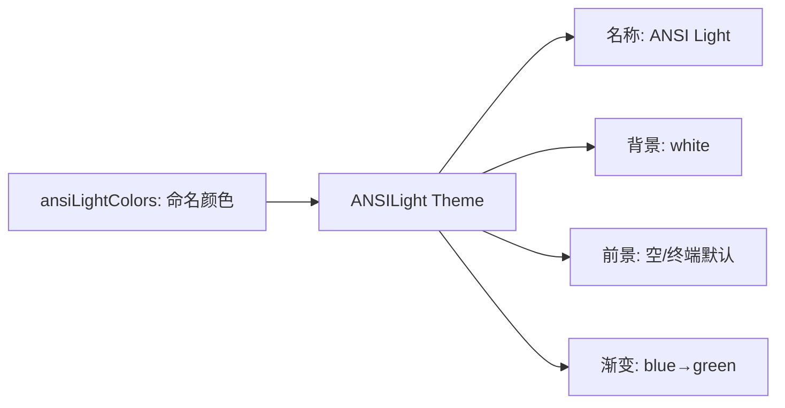

# ansi-light.ts

> 定义 ANSI 浅色主题，仅使用基本 ANSI 颜色名称适配浅色终端

## 概述

`ansi-light.ts` 导出 `ANSILight` 主题实例，是 ANSI 深色主题的浅色对应版本。使用 `white` 背景和 ANSI 基本颜色名称，并使用 `orange`（通过 tinycolor 解析）替代 `yellow` 作为 AccentYellow，以确保在白色背景上的可读性。

## 架构图（mermaid）

## 主要导出

| 名称 | 类型 | 说明 |
|------|------|------|
| `ANSILight` | `Theme` | ANSI 浅色主题实例 |

## 核心逻辑

- 颜色名称：`blue`、`cyan`、`green`、`red`、`magenta`、`purple`、`orange`、`gray`、`black`
- hljs 映射中使用 `black` 替代 `white` 作为默认文本色和函数/参数色
- 使用 `lightSemanticColors` 作为语义颜色
- AccentPurple 使用 `purple`（不同于 ANSI Dark 的 `magenta`）
- Diff 背景使用浅色 Hex 值（#E5F2E5 / #FFE5E5）

## 内部依赖

| 模块 | 用途 |
|------|------|
| `../../theme.js` | `ColorsTheme`, `Theme` |
| `../../semantic-tokens.js` | `lightSemanticColors` |

## 外部依赖

无
