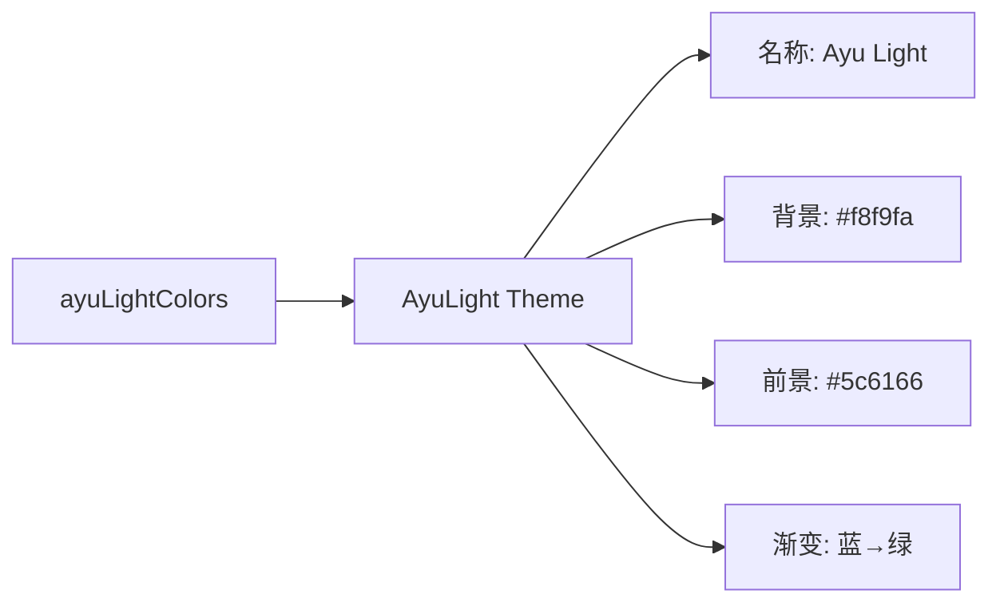

# ayu-light.ts

> 定义 Ayu 浅色主题，灵感来自 Ayu 编辑器配色方案的浅色变体

## 概述

`ayu-light.ts` 导出 `AyuLight` 主题实例，采用 Ayu 配色方案的浅色版本。以近白色（#f8f9fa）为背景，搭配柔和但清晰的彩色强调色。

## 架构图（mermaid）

## 主要导出

| 名称 | 类型 | 说明 |
|------|------|------|
| `AyuLight` | `Theme` | Ayu 浅色主题实例 |

## 核心逻辑

特色配色：关键字 → AccentYellow (#f2ae49)，字符串 → AccentGreen (#86b300)，数字 → AccentPurple (#a37acc)，标题 → AccentBlue (#399ee6)。

## 内部依赖

| 模块 | 用途 |
|------|------|
| `../../theme.js` | `ColorsTheme`, `Theme` |
| `../../color-utils.js` | `interpolateColor` |

## 外部依赖

无
