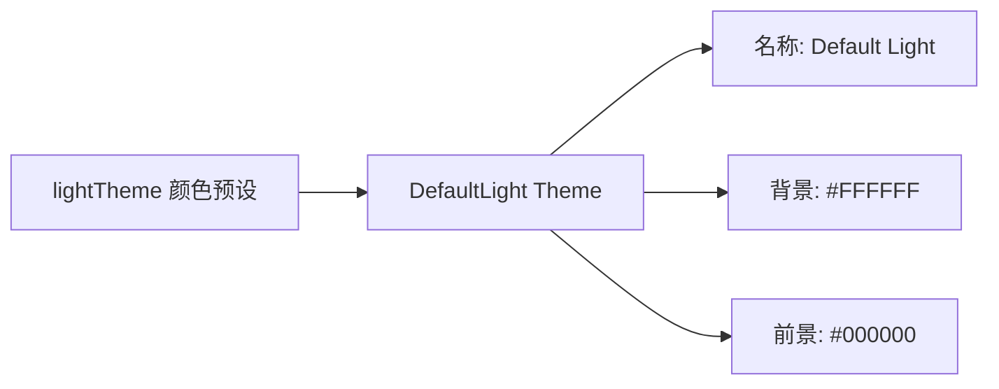

# default-light.ts

> 定义默认浅色主题，作为浅色终端的出厂默认主题

## 概述

`default-light.ts` 导出 `DefaultLight` 主题实例，使用 `theme.ts` 中预定义的 `lightTheme` 颜色配置。当检测到终端为浅色背景时，ThemeManager 会自动切换到此主题。

## 架构图（mermaid）

## 主要导出

| 名称 | 类型 | 说明 |
|------|------|------|
| `DefaultLight` | `Theme` | 默认浅色主题实例 |

## 核心逻辑

基于 `lightTheme` 构建代码高亮映射，使用较暗的饱和色确保在白色背景上的可读性：
- 关键字/内置/名称/标签 → AccentBlue (#005FAF)
- 字符串/标题/属性/字面量 → AccentRed (#AF0000)
- 加减/删除 → AccentGreen/AccentRed
- 注释 → Comment (#008700)

## 内部依赖

| 模块 | 用途 |
|------|------|
| `../../theme.js` | `lightTheme`, `Theme` |

## 外部依赖

无
