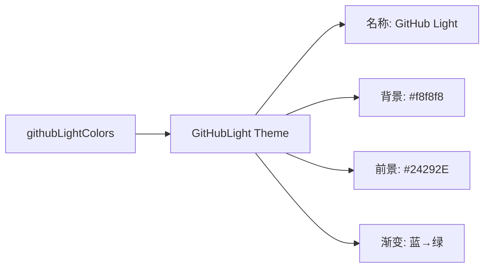

# github-light.ts

> 定义 GitHub Light 主题，灵感来自 GitHub 的浅色代码查看器配色

## 概述

`github-light.ts` 导出 `GitHubLight` 主题实例，模拟 GitHub 网站的浅色代码高亮风格。以浅灰白色（#f8f8f8）为背景，使用经典的深色文字和含蓄的彩色高亮。FocusColor 使用 GitHub 品牌蓝 (#458)。

## 架构图（mermaid）

## 主要导出

| 名称 | 类型 | 说明 |
|------|------|------|
| `GitHubLight` | `Theme` | GitHub 浅色主题实例 |

## 核心逻辑

特色配色：关键字 → 前景色加粗，字符串 → AccentRed (#d14)，标题 → AccentPurple (#900) 加粗，类型 → AccentBlue (#458) 加粗，数字/变量 → AccentGreen (#008080)。

## 内部依赖

| 模块 | 用途 |
|------|------|
| `../../theme.js` | `ColorsTheme`, `Theme` |
| `../../color-utils.js` | `interpolateColor` |

## 外部依赖

无
