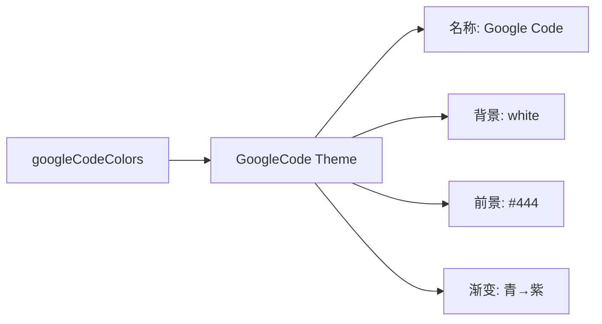

# googlecode-light.ts

> 定义 Google Code 浅色主题，灵感来自 Google Code 代码查看器配色

## 概述

`googlecode-light.ts` 导出 `GoogleCode` 主题实例，模拟 Google Code（已停运）代码托管平台的代码高亮风格。以白色为背景，使用简洁的暗色调配色。

## 架构图（mermaid）

## 主要导出

| 名称 | 类型 | 说明 |
|------|------|------|
| `GoogleCode` | `Theme` | Google Code 浅色主题实例 |

## 核心逻辑

特色配色：注释 → AccentRed (#800)，关键字/名称 → AccentBlue (#008)，字符串 → AccentGreen (#080)，变量 → AccentYellow (#660)，标题/类型 → AccentPurple (#606)，数字/字面量 → AccentCyan (#066)。使用 `lightTheme.Gray` 作为灰色基准。

## 内部依赖

| 模块 | 用途 |
|------|------|
| `../../theme.js` | `ColorsTheme`, `Theme`, `lightTheme` |
| `../../color-utils.js` | `interpolateColor` |

## 外部依赖

无
