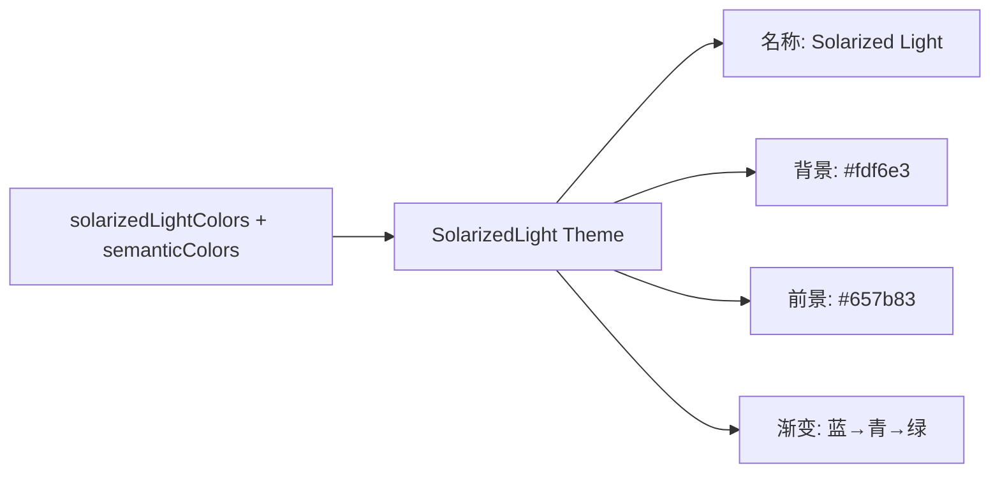

# solarized-light.ts

> 定义 Solarized Light 主题，基于 Ethan Schoonover 的 Solarized 配色方案亮色变体

## 概述

`solarized-light.ts` 导出 `SolarizedLight` 主题实例，忠实还原 Solarized 配色方案的浅色版本。以米黄色（#fdf6e3）为背景，提供精心调校的自定义 `SemanticColors`。与 `solarized-dark.ts` 共享相同的强调色体系。

## 架构图（mermaid）

## 主要导出

| 名称 | 类型 | 说明 |
|------|------|------|
| `SolarizedLight` | `Theme` | Solarized Light 主题实例 |

## 核心逻辑

- 自定义 `SemanticColors` 指定 message/input 背景为 #eee8d5（base2）
- 与 Solarized Dark 共享 AccentBlue/Cyan/Green/Yellow/Red/Purple 等强调色
- Diff 背景使用柔和的浅绿/浅红（#d7f2d7 / #f2d7d7）
- focus 背景使用 `interpolateColor` 与 AccentGreen (#859900) 混合

## 内部依赖

| 模块 | 用途 |
|------|------|
| `../../theme.js` | `ColorsTheme`, `Theme`, `interpolateColor` |
| `../../semantic-tokens.js` | `SemanticColors` |
| `../../../constants.js` | `DEFAULT_SELECTION_OPACITY` |

## 外部依赖

无
