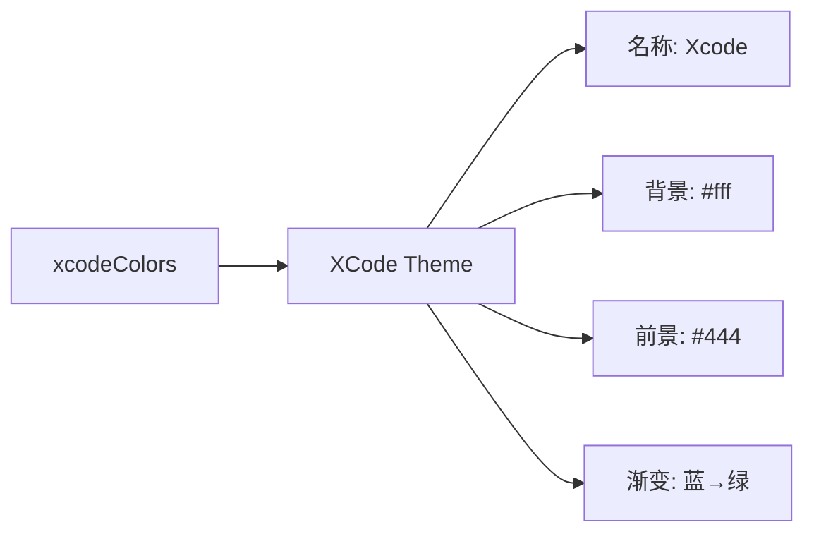

# xcode-light.ts

> 定义 Xcode 浅色主题，灵感来自 Apple Xcode IDE 的默认代码配色

## 概述

`xcode-light.ts` 导出 `XCode` 主题实例，模拟 Xcode IDE 的经典浅色代码高亮风格。以白色为背景，使用紫色关键字和绿色注释的标志性配色。FocusColor 使用 AccentBlue (#1c00cf) 增强视觉辨识度。

## 架构图（mermaid）

## 主要导出

| 名称 | 类型 | 说明 |
|------|------|------|
| `XCode` | `Theme` | Xcode 浅色主题实例 |

## 核心逻辑

特色配色：关键字/标签/类型/内置 → AccentPurple (#aa0d91)，注释 → Comment (#007400 绿色)，字符串 → AccentRed (#c41a16)，标题/数字/符号 → AccentBlue (#1c00cf)，正则 → LightBlue (#0E0EFF)。

## 内部依赖

| 模块 | 用途 |
|------|------|
| `../../theme.js` | `ColorsTheme`, `Theme` |
| `../../color-utils.js` | `interpolateColor` |

## 外部依赖

无
