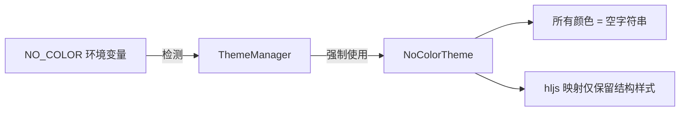

# no-color.ts

> 定义无颜色主题，用于 NO_COLOR 环境变量启用时禁用所有颜色输出

## 概述

`no-color.ts` 导出 `NoColorTheme`，一个所有颜色属性均为空字符串的 Theme 实例。当检测到 `NO_COLOR` 环境变量时，`ThemeManager` 会强制使用此主题，使 CLI 输出不包含任何颜色转义序列，满足无障碍和管道输出需求。

## 架构图（mermaid）

## 主要导出

| 名称 | 类型 | 说明 |
|------|------|------|
| `NoColorTheme` | `Theme` | 无颜色主题实例，所有颜色为空字符串 |

## 核心逻辑

- `noColorColorsTheme`：所有 `ColorsTheme` 属性设为空字符串 `''`
- `noColorSemanticColors`：所有 `SemanticColors` 属性设为空字符串，`gradient` 为空数组
- hljs 映射中仅保留 `fontStyle`（斜体）、`fontWeight`（粗体）等非颜色样式
- 主题类型设为 `'dark'`（用于分类排序，实际无影响）

## 内部依赖

| 模块 | 用途 |
|------|------|
| `../theme.js` | `Theme` 类, `ColorsTheme` 类型 |
| `../semantic-tokens.js` | `SemanticColors` 类型 |

## 外部依赖

无
