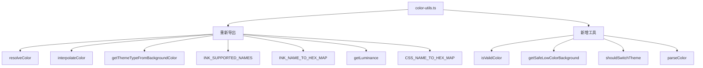
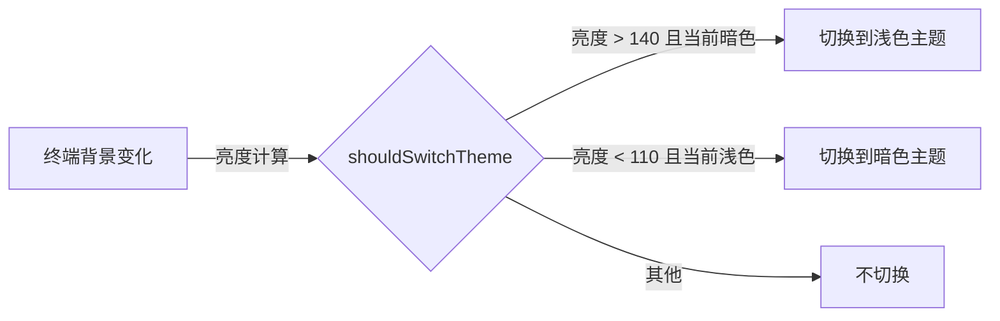

# color-utils.ts

> 提供颜色验证、安全背景色计算、主题切换迟滞判断和 X11 RGB 颜色解析工具

## 概述

`color-utils.ts` 是主题系统的颜色工具箱，除了重新导出 `theme.ts` 中的颜色解析函数外，还提供了额外的颜色验证（`isValidColor`）、低色终端安全背景色（`getSafeLowColorBackground`）、基于迟滞（hysteresis）的主题切换判断（`shouldSwitchTheme`）和 X11 RGB 字符串解析（`parseColor`）功能。

## 架构图（mermaid）

## 主要导出

### 重新导出（来自 theme.ts）

| 名称 | 说明 |
|------|------|
| `resolveColor`, `interpolateColor`, `getThemeTypeFromBackgroundColor`, `getLuminance` | 颜色操作函数 |
| `INK_SUPPORTED_NAMES`, `INK_NAME_TO_HEX_MAP`, `CSS_NAME_TO_HEX_MAP` | 颜色名称映射表 |

### 新增导出

| 名称 | 说明 |
|------|------|
| `isValidColor(color)` | 验证颜色字符串是否合法（Hex/Ink 名/CSS 名） |
| `getSafeLowColorBackground(bg)` | 为标准黑/白终端背景返回安全的低对比度背景色 |
| `shouldSwitchTheme(current, luminance, dark, light)` | 基于迟滞判断是否需要切换明/暗主题 |
| `parseColor(r, g, b)` | 解析 X11 RGB 字符串（来自 OSC 11 终端查询）为 Hex |
| `LIGHT_THEME_LUMINANCE_THRESHOLD` | 切换到浅色主题的亮度阈值（140） |
| `DARK_THEME_LUMINANCE_THRESHOLD` | 切换到暗色主题的亮度阈值（110） |

## 核心逻辑

### isValidColor
1. Hex 格式验证（`#RGB` 或 `#RRGGBB`）
2. Ink 命名颜色检查
3. CSS 命名颜色检查

### getSafeLowColorBackground
- 纯黑（`#000000`）→ `#1c1c1c`（深灰）
- 纯白（`#ffffff`）→ `#eeeeee`（浅灰）
- 其他背景 → `undefined`

### shouldSwitchTheme（迟滞防抖）
- 使用两个不同的阈值（140/110）防止在临界亮度附近反复切换
- 仅在当前为默认主题时才考虑切换

### parseColor
- 支持 1-4 位 Hex 分量（X11 格式支持 4/8/12/16 位颜色深度）
- 统一转换为 `#RRGGBB` 格式

## 内部依赖

| 模块 | 用途 |
|------|------|
| `./theme.js` | 颜色工具函数（重新导出源） |

## 外部依赖

无
