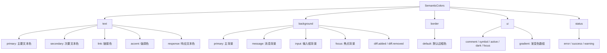

# semantic-tokens.ts

> 定义语义化颜色接口以及明/暗主题的语义颜色预设实例

## 概述

`semantic-tokens.ts` 定义了 `SemanticColors` 接口，将颜色按用途（而非具体色值）分为五大类：文本（`text`）、背景（`background`）、边框（`border`）、UI 元素（`ui`）和状态（`status`）。同时提供 `lightSemanticColors` 和 `darkSemanticColors` 两套预设实例。

## 架构图（mermaid）

## 主要导出

| 名称 | 类型 | 说明 |
|------|------|------|
| `SemanticColors` | `interface` | 语义化颜色结构定义 |
| `lightSemanticColors` | `SemanticColors` | 浅色主题语义颜色预设 |
| `darkSemanticColors` | `SemanticColors` | 深色主题语义颜色预设 |

## 核心逻辑

- `lightSemanticColors` 从 `lightTheme` (ColorsTheme) 映射而来
- `darkSemanticColors` 从 `darkTheme` (ColorsTheme) 映射而来
- 映射规则一致：`Foreground`→`text.primary`、`Gray`→`text.secondary`、`AccentBlue`→`text.link` 等

## 内部依赖

| 模块 | 用途 |
|------|------|
| `./theme.js` → `lightTheme`, `darkTheme` | 内置颜色预设 |

## 外部依赖

无
