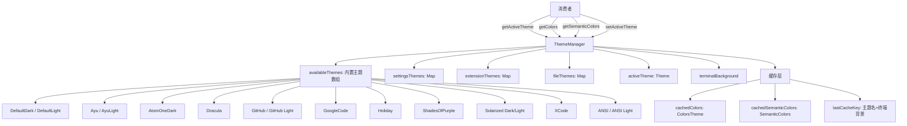
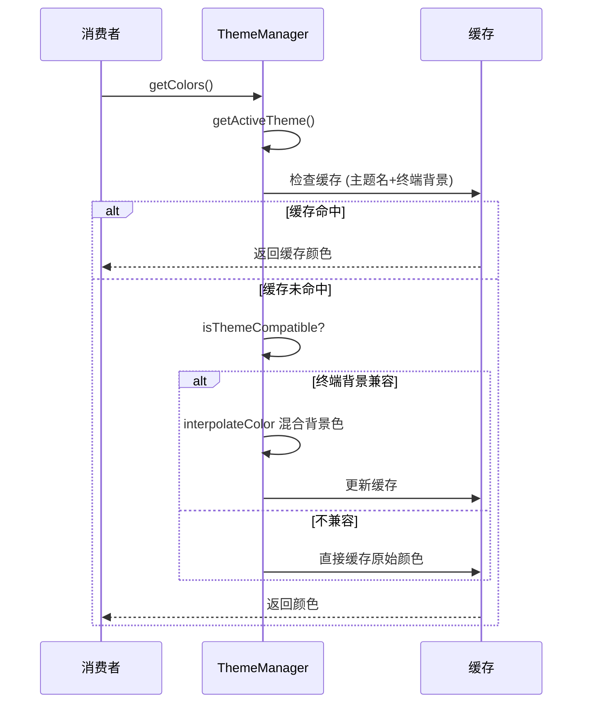

# theme-manager.ts

> 全局主题管理器单例，负责主题注册、切换、缓存和终端背景自适应

## 概述

`theme-manager.ts` 是主题系统的中枢管理器（约 659 行），导出一个 `ThemeManager` 单例 `themeManager`。它管理内置主题（16 个）、设置中的自定义主题、扩展提供的主题和文件加载的主题。提供主题查找、切换、颜色获取（带终端背景自适应缓存）、主题兼容性检查等功能。

## 架构图（mermaid）

## 主要导出

| 名称 | 类型 | 说明 |
|------|------|------|
| `ThemeDisplay` | `interface` | 主题列表显示信息 |
| `DEFAULT_THEME` | `Theme` | 默认主题（DefaultDark） |
| `themeManager` | `ThemeManager` | 全局单例实例 |

## ThemeManager 主要方法

| 方法 | 说明 |
|------|------|
| `setTerminalBackground(color)` | 设置终端背景色，触发缓存清除 |
| `getTerminalBackground()` | 获取终端背景色 |
| `isDefaultTheme(name)` | 判断是否为默认主题 |
| `loadCustomThemes(settings)` | 从设置加载自定义主题 |
| `registerExtensionThemes(name, themes)` | 注册扩展提供的主题（命名空间隔离） |
| `unregisterExtensionThemes(name, themes)` | 注销扩展主题 |
| `hasExtensionThemes(name)` | 检查扩展是否有已注册主题 |
| `setActiveTheme(name)` | 设置活跃主题 |
| `getActiveTheme()` | 获取活跃主题（支持 NO_COLOR 环境变量） |
| `getColors()` | 获取终端背景自适应的颜色（带缓存） |
| `getSemanticColors()` | 获取终端背景自适应的语义颜色（带缓存） |
| `isThemeCompatible(theme, bg)` | 检查主题与终端背景的明暗兼容性 |
| `getAvailableThemes()` | 获取排序后的所有可用主题列表 |
| `getTheme(name)` | 按名称查找主题 |
| `getAllThemes()` | 获取所有主题（内置+自定义） |
| `findThemeByName(name)` | 查找主题（支持内置/设置/扩展/文件路径） |

## 核心逻辑

### 主题来源优先级（findThemeByName）
1. **内置主题**：16 个预定义主题
2. **文件路径主题**：以 `.json`/`.`/绝对路径开头的名称，从文件系统加载
3. **设置主题**：从 `settings.json` 加载的自定义主题
4. **扩展主题**：扩展注册的主题（以 `"主题名 (扩展名)"` 格式命名）
5. **文件缓存主题**：已加载的文件主题缓存

### 终端背景自适应（getColors/getSemanticColors）
- 使用 `主题名:终端背景色` 作为缓存键
- 仅在主题与终端背景兼容时混合背景色
- 使用 `interpolateColor` 计算 `DarkGray`、`InputBackground`、`MessageBackground`、`FocusBackground`

### 主题兼容性判断（isThemeCompatible）
- ANSI 主题始终兼容
- 自定义主题根据其 `Background` 色判断明暗
- 只有主题类型与终端背景类型一致时才兼容

### 文件主题加载安全性
- 使用 `realpathSync` 解析真实路径
- **安全检查**：主题文件必须位于用户主目录下
- JSON 解析 + 验证 + 缓存

### 扩展主题命名空间
- 扩展主题名格式：`"主题名 (扩展名)"`
- 防止与内置主题名冲突
- 扩展卸载时可清理

### NO_COLOR 支持
- 检测 `NO_COLOR` 环境变量
- 存在时强制返回 `NoColorTheme`（所有颜色为空字符串）

## 内部依赖

| 模块 | 用途 |
|------|------|
| `./theme.js` | Theme 类、颜色工具、内置颜色预设 |
| `./semantic-tokens.js` | SemanticColors 接口 |
| `./builtin/dark/*.js` | 9 个深色内置主题 |
| `./builtin/light/*.js` | 7 个浅色内置主题 |
| `./builtin/no-color.js` | 无色主题 |
| `../constants.js` | 不透明度常量 |

## 外部依赖

| 模块 | 用途 |
|------|------|
| `node:fs` | 文件主题读取 |
| `node:path` | 路径处理 |
| `node:process` | `NO_COLOR` 环境变量 |
| `@google/gemini-cli-core` | `debugLogger`, `homedir` |
