# theme.ts

> 定义主题核心类型体系、Theme 类、内置颜色配置和自定义主题工厂函数

## 概述

`theme.ts` 是主题系统的基础模块（约 693 行），定义了颜色解析工具、`ColorsTheme` 接口（原始颜色板）、`Theme` 类（集成代码高亮映射和语义颜色）、三套内置颜色预设（`lightTheme`/`darkTheme`/`ansiTheme`）以及自定义主题的创建、验证和默认主题选择逻辑。

## 架构图（mermaid）

```mermaid
graph TD
    A[theme.ts] --> B[颜色工具函数]
    A --> C[ColorsTheme 接口]
    A --> D[Theme 类]
    A --> E[内置颜色预设]
    A --> F[自定义主题工厂]
    A --> G[主题选择逻辑]

    B --> B1[resolveColor: CSS/Hex/Ink名称解析]
    B --> B2[interpolateColor: 双色渐变插值]
    B --> B3[getLuminance: 亮度计算]
    B --> B4[getThemeTypeFromBackgroundColor: 明暗判断]

    C --> C1[16种颜色属性]
    C --> C2[可选: InputBackground/MessageBackground/FocusBackground/GradientColors]

    D --> D1[name/type]
    D --> D2[colors: ColorsTheme]
    D --> D3[semanticColors: SemanticColors]
    D --> D4[_colorMap: hljs类名→Ink颜色]
    D --> D5[defaultColor: 默认前景色]
    D --> D6[getInkColor: 获取代码高亮颜色]

    E --> E1[lightTheme]
    E --> E2[darkTheme]
    E --> E3[ansiTheme]

    F --> F1[createCustomTheme]
    F --> F2[validateCustomTheme]
```

## 主要导出

### 类型与接口

| 名称 | 说明 |
|------|------|
| `ThemeType` | `'light' \| 'dark' \| 'ansi' \| 'custom'` |
| `ColorsTheme` | 原始颜色板接口：背景/前景/强调色/Diff 色/灰度/渐变色等 |
| `CustomTheme` | 从 core 重新导出的自定义主题配置类型 |

### 颜色工具

| 名称 | 说明 |
|------|------|
| `resolveColor(value)` | 将 CSS 颜色名/Hex 值解析为 Ink 兼容字符串 |
| `interpolateColor(c1, c2, factor)` | 在两个颜色间进行渐变插值 |
| `getLuminance(color)` | 计算颜色相对亮度（0-255） |
| `getThemeTypeFromBackgroundColor(bg)` | 根据背景亮度判断应使用明/暗主题 |
| `INK_SUPPORTED_NAMES` | Ink 支持的颜色名称集合 |
| `CSS_NAME_TO_HEX_MAP` | CSS 颜色名到 Hex 的映射 |
| `INK_NAME_TO_HEX_MAP` | ANSI Bright 颜色名到 Hex 的映射 |

### Theme 类

| 名称 | 说明 |
|------|------|
| `Theme` | 主题类，封装名称、类型、颜色板、语义颜色和代码高亮颜色映射 |

### 内置预设

| 名称 | 说明 |
|------|------|
| `lightTheme` | 浅色主题颜色配置 |
| `darkTheme` | 深色主题颜色配置 |
| `ansiTheme` | ANSI 终端兼容颜色配置（使用命名颜色） |

### 工厂函数

| 名称 | 说明 |
|------|------|
| `createCustomTheme(config)` | 从自定义配置创建 Theme 实例，自动生成 hljs 映射和语义颜色 |
| `validateCustomTheme(config)` | 验证自定义主题配置（当前仅验证名称） |
| `pickDefaultThemeName(bg, themes, dark, light)` | 根据终端背景色选择最佳默认主题名 |

## 核心逻辑

### 颜色解析 (`resolveColor`)
1. Hex 代码直接验证格式
2. 无 `#` 的 Hex 自动添加前缀
3. Ink 支持的命名颜色直接使用
4. 其他名称通过 tinycolor 解析为 Hex

### Theme 类构造
1. 构建 `_colorMap`：遍历 hljs 主题映射，提取 `color` 属性并解析
2. 确定 `defaultColor`：从 `hljs` 基础样式获取默认前景色
3. 生成 `semanticColors`：若未提供则从 `ColorsTheme` 自动推导

### 自定义主题创建 (`createCustomTheme`)
1. 从自定义配置解析颜色值，使用 `interpolateColor` 计算混合背景色
2. 生成完整的 hljs 类名→颜色映射（30+ 个映射）
3. 组装 `SemanticColors` 结构
4. 返回 `Theme` 实例

### 默认主题选择 (`pickDefaultThemeName`)
1. 先尝试精确匹配终端背景色
2. 匹配失败则根据亮度选择明/暗默认主题

## 内部依赖

| 模块 | 用途 |
|------|------|
| `./semantic-tokens.js` → `SemanticColors` | 语义颜色接口 |
| `../constants.js` | 不透明度常量 |

## 外部依赖

| 模块 | 用途 |
|------|------|
| `react` | `CSSProperties` 类型 |
| `tinycolor2` | 颜色解析、亮度计算 |
| `tinygradient` | 颜色渐变插值 |
| `@google/gemini-cli-core` | `CustomTheme` 类型 |
