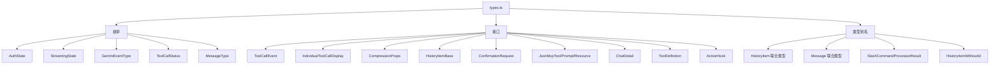

# types.ts

> 定义 Gemini CLI UI 层的所有核心类型、枚举和接口

## 概述

`types.ts` 是 UI 层的类型中心，定义了认证状态、流式传输状态、工具调用状态、历史记录项、消息类型、MCP 状态、斜杠命令结果等几乎所有 UI 交互所需的类型。它是 CLI 前端架构中最基础的类型文件，被大量组件和 Hook 导入使用。

## 架构图（mermaid）

## 主要导出

### 枚举

| 名称 | 说明 |
|------|------|
| `AuthState` | 认证状态：`Unauthenticated` / `Updating` / `AwaitingApiKeyInput` / `Authenticated` / `AwaitingGoogleLoginRestart` |
| `StreamingState` | 流式状态：`Idle` / `Responding` / `WaitingForConfirmation` |
| `GeminiEventType` | Gemini 事件类型：`Content` / `ToolCallRequest` |
| `ToolCallStatus` | 工具调用状态：`Pending` / `Canceled` / `Confirming` / `Executing` / `Success` / `Error` |
| `MessageType` | 消息类型枚举，对应各种内部命令反馈类型 |

### 核心函数

| 名称 | 说明 |
|------|------|
| `mapCoreStatusToDisplayStatus` | 将核心层 `CoreToolCallStatus` 映射为简化的 UI 层 `ToolCallStatus` |

### 核心接口

| 名称 | 说明 |
|------|------|
| `ToolCallEvent` | 工具调用事件数据 |
| `IndividualToolCallDisplay` | 单个工具调用的显示信息（含状态、描述、确认详情等） |
| `CompressionProps` | 上下文压缩属性 |
| `HistoryItem` | 历史记录项（带 `id` 的联合类型，包含 20+ 种子类型） |
| `SlashCommandProcessorResult` | 斜杠命令处理结果 |
| `ConfirmationRequest` | 确认请求接口 |
| `HistoryItemMcpStatus` | MCP 服务器状态历史记录项 |

### 常量

| 名称 | 说明 |
|------|------|
| `emptyIcon` | 空图标占位符 `'  '`（两个空格） |

## 核心逻辑

1. **状态映射**：`mapCoreStatusToDisplayStatus` 使用 `checkExhaustive` 确保所有核心状态都被映射到 UI 状态
2. **历史记录联合类型**：`HistoryItemWithoutId` 是 20+ 种历史记录类型的联合，`HistoryItem` 在此基础上添加 `id` 字段
3. **MCP 状态**：`HistoryItemMcpStatus` 包含服务器配置、工具/提示/资源列表、认证状态、启用状态等完整信息

## 内部依赖

无（作为类型定义文件，被其他模块单向依赖）

## 外部依赖

| 模块 | 用途 |
|------|------|
| `@google/gemini-cli-core` | 多种核心类型：`CompressionStatus`, `MCPServerConfig`, `CoreToolCallStatus`, `checkExhaustive` 等 |
| `@google/genai` | `PartListUnion` 类型 |
| `react` | `ReactNode` 类型 |
