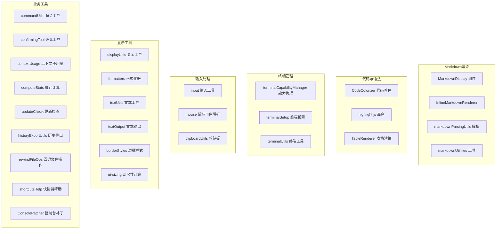

# utils 架构

> UI 工具函数库，提供 Markdown 渲染、语法高亮、终端管理等核心工具

## 概述

`utils` 目录包含 Gemini CLI UI 层的工具函数和辅助组件。这些工具覆盖了 Markdown 渲染和解析、代码语法高亮、终端能力检测和管理、输入处理、剪贴板操作、URL 安全检查、文本格式化、更新检查等多个方面。它们是 UI 组件和 Hooks 的基础设施。

## 架构图



## 目录结构

```
utils/
├── MarkdownDisplay.tsx            # Markdown 渲染组件
├── InlineMarkdownRenderer.tsx     # 内联 Markdown 渲染器
├── markdownParsingUtils.ts        # Markdown 解析工具
├── markdownUtilities.ts           # Markdown 相关工具函数
├── CodeColorizer.tsx              # 代码着色组件
├── highlight.ts                   # 语法高亮工具
├── TableRenderer.tsx              # 表格渲染组件
├── terminalCapabilityManager.ts   # 终端能力检测和管理
├── terminalSetup.ts               # 终端初始设置
├── terminalUtils.ts               # 终端工具函数
├── input.ts                       # 输入处理工具
├── mouse.ts                       # 鼠标事件解析
├── clipboardUtils.ts              # 剪贴板读写
├── urlSecurityUtils.ts            # URL 安全检查
├── displayUtils.ts                # 显示辅助工具
├── formatters.ts                  # 数字/时间格式化
├── textUtils.ts                   # 文本处理工具
├── textOutput.ts                  # 文本输出工具
├── borderStyles.ts                # 边框样式定义
├── ui-sizing.ts                   # UI 尺寸计算
├── commandUtils.ts                # 命令识别工具
├── confirmingTool.ts              # 工具确认逻辑
├── contextUsage.ts                # 上下文窗口使用量计算
├── computeStats.ts                # 统计信息计算
├── updateCheck.ts                 # CLI 更新检查
├── historyExportUtils.ts          # 历史记录导出
├── rewindFileOps.ts               # 回退操作的文件操作
├── shortcutsHelp.ts               # 快捷键帮助信息生成
├── toolLayoutUtils.ts             # 工具消息布局
├── directoryUtils.ts              # 目录操作工具
├── editorUtils.ts                 # 编辑器相关工具
├── ConsolePatcher.ts              # console 输出拦截和收集
├── isNarrowWidth.ts               # 窄屏检测
├── inlineThinkingMode.ts          # 内联思考模式
└── pendingAttentionNotification.ts # 待处理通知
```

## 关键文件

| 文件 | 功能 |
|------|------|
| `MarkdownDisplay.tsx` | 核心 Markdown 渲染组件，将 Markdown 文本解析为终端可显示的 Ink 组件树，支持代码块、列表、表格、链接等 |
| `CodeColorizer.tsx` | 代码着色组件，使用 highlight.js 进行语法高亮，映射到当前主题颜色 |
| `highlight.ts` | highlight.js 集成，管理语言注册和高亮 token 颜色映射 |
| `terminalCapabilityManager.ts` | 终端能力管理器，检测和启用 Kitty 键盘协议、bracketed paste 等高级终端特性 |
| `ConsolePatcher.ts` | 拦截 console.log/warn/error 输出，收集到 UI 的调试控制台显示 |
| `contextUsage.ts` | 计算 AI 上下文窗口的使用百分比，用于页脚显示 |
| `updateCheck.ts` | 检查 Gemini CLI 新版本，支持 npm 和其他安装方式 |
| `clipboardUtils.ts` | 跨平台剪贴板读写，支持 macOS pbcopy/pbpaste、xclip 等 |
| `ui-sizing.ts` | 计算主内容区域宽度，考虑全宽模式和终端尺寸 |

## 内部依赖

- `../colors` - 颜色定义
- `../semantic-colors` - 语义颜色
- `../themes/theme-manager` - 主题管理器（代码高亮使用）
- `../themes/theme` - Theme 类
- `../constants` - UI 常量
- `../key/keyBindings` - 键绑定配置
- `../key/keybindingUtils` - 绑定格式化
- `../hooks/useKeypress` - Key 类型

## 外部依赖

| 包名 | 用途 |
|------|------|
| `ink` | Box、Text 组件 |
| `react` | 组件框架 |
| `highlight.js` | 语法高亮引擎 |
| `@google/gemini-cli-core` | Config、debugLogger 等 |
| `node:child_process` | 剪贴板操作（pbcopy 等） |
