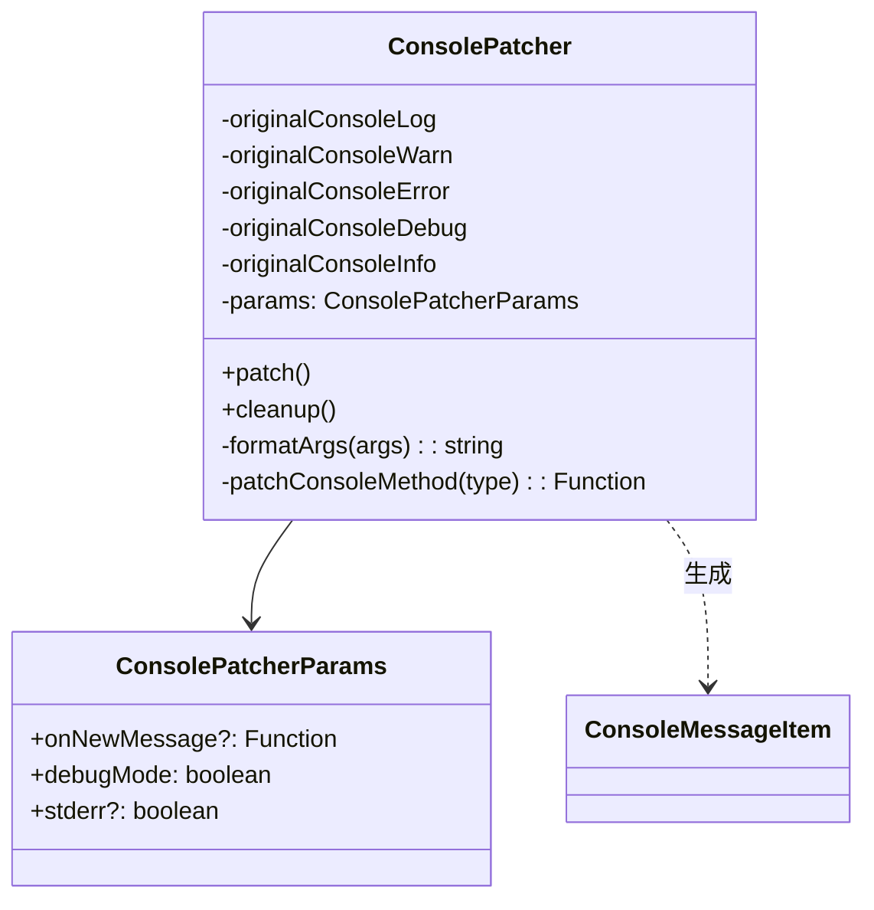

# ConsolePatcher.ts

> 拦截并重定向全局 console 方法（log/warn/error/debug/info）的补丁工具类

## 概述

`ConsolePatcher` 类用于在 Ink TUI 应用中接管所有 `console` 输出方法。补丁后的 console 方法不再直接写入 stdout，而是通过回调 `onNewMessage` 把消息推送给 UI 层，或者在 `stderr` 模式下将消息重定向到 `process.stderr`。调用 `cleanup()` 可恢复原始 console 行为。调试级别日志（`console.debug`）仅在 `debugMode` 为 true 时才输出。

## 架构图（mermaid）

## 主要导出

| 导出名 | 类型 | 说明 |
|--------|------|------|
| `ConsolePatcher` | class | 控制台方法拦截器，提供 `patch()` 和 `cleanup()` 方法 |

## 核心逻辑

1. **patch()**: 将 `console.log/warn/error/debug/info` 五个方法替换为自定义实现。
2. **patchConsoleMethod()**: 根据 `stderr` 参数决定将输出重定向到 `process.stderr`（通过 `originalConsoleError`）还是触发 `onNewMessage` 回调。`debug` 级别只在 `debugMode === true` 时生效。
3. **formatArgs()**: 使用 `util.format()` 将可变参数格式化为字符串。
4. **cleanup()**: 恢复所有 console 方法到原始实现，保证应用退出时终端行为正常。

## 内部依赖

| 模块 | 说明 |
|------|------|
| `../types.js` | 导入 `ConsoleMessageItem` 类型 |

## 外部依赖

| 模块 | 说明 |
|------|------|
| `node:util` | 使用 `util.format` 格式化参数 |
