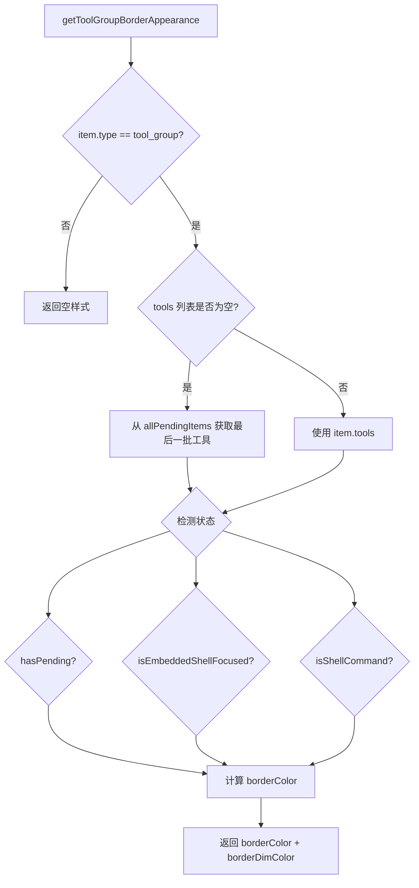

# borderStyles.ts

> 根据工具组状态（执行中、Shell 聚焦、已完成等）计算边框颜色与是否减淡显示

## 概述

此文件导出 `getToolGroupBorderAppearance` 函数，用于为工具组消息组件动态计算边框样式。它综合考虑工具调用状态（等待中、成功、失败）、嵌入式 Shell 是否聚焦、后台 Shell 列表等因素，返回边框颜色和是否启用减淡（dim）效果。

## 架构图（mermaid）

## 主要导出

| 导出名 | 类型 | 说明 |
|--------|------|------|
| `getToolGroupBorderAppearance` | function | 计算工具组边框的颜色和减淡状态 |

## 核心逻辑

1. 非 `tool_group` 类型直接返回空样式。
2. 当工具列表为空时（代表当前批次的闭合切片），从 `allPendingItems` 中获取最后一批工具用于检测。
3. 检测三个关键状态：`hasPending`（是否有未完成工具）、`isEmbeddedShellFocused`（Shell 是否聚焦）、`isShellCommand`（是否为 Shell 类工具）。
4. 颜色优先级：聚焦 > Shell 执行中 > 普通等待中 > 默认。

## 内部依赖

| 模块 | 说明 |
|------|------|
| `../components/messages/ToolShared.js` | `isShellTool` 判断是否为 Shell 工具 |
| `../semantic-colors.js` | `theme` 主题颜色 |
| `../types.js` | UI 历史条目类型定义 |
| `../hooks/shellReducer.js` | `BackgroundShell` 类型 |
| `../hooks/useToolScheduler.js` | `TrackedToolCall` 类型 |

## 外部依赖

| 模块 | 说明 |
|------|------|
| `@google/gemini-cli-core` | `CoreToolCallStatus` 枚举 |
