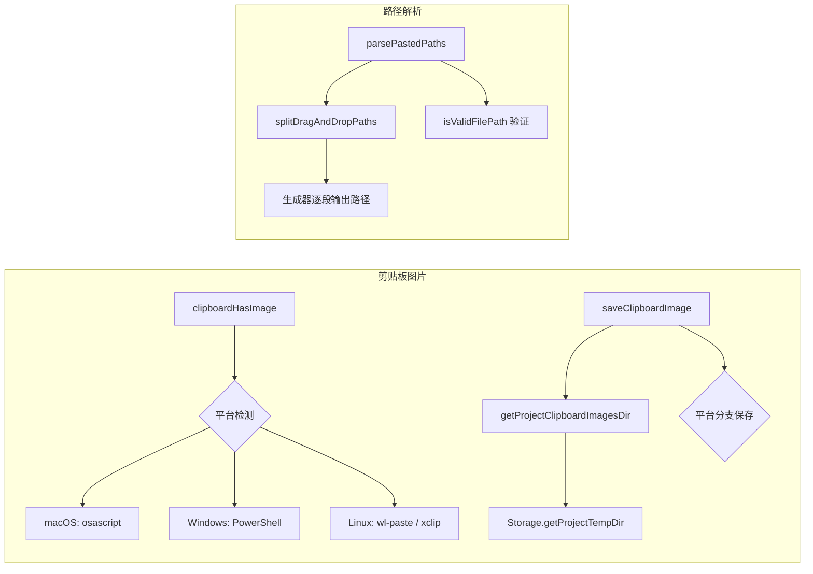

# clipboardUtils.ts

> 跨平台剪贴板图片检测、保存、清理及拖拽路径解析工具集

## 概述

本文件提供完整的剪贴板图片处理管线，支持 macOS（osascript）、Windows（PowerShell）和 Linux（wl-paste/xclip）三大平台。主要功能包括：检测剪贴板中是否包含图片、将剪贴板图片保存到项目临时目录、清理过期的临时图片文件。此外还提供了拖拽文件路径的解析逻辑，能处理单引号/双引号/反斜杠转义等多种路径格式。

## 架构图（mermaid）

## 主要导出

| 导出名 | 类型 | 说明 |
|--------|------|------|
| `IMAGE_EXTENSIONS` | const string[] | 支持的图片扩展名列表（png/jpg/jpeg/webp/heic/heif） |
| `clipboardHasImage` | async function | 检测系统剪贴板是否包含图片 |
| `saveClipboardImage` | async function | 将剪贴板图片保存到项目临时目录，返回文件路径 |
| `cleanupOldClipboardImages` | async function | 清理超过 1 小时的旧临时图片 |
| `splitDragAndDropPaths` | generator function | 解析拖拽粘贴文本为路径段的生成器 |
| `parsePastedPaths` | function | 处理粘贴的文件路径，添加 `@` 前缀并转义 |

## 核心逻辑

1. **平台检测**：`getUserLinuxClipboardTool()` 根据 `XDG_SESSION_TYPE` 环境变量判断 Wayland/X11，缓存结果避免重复检测。
2. **安全的命令输出保存**：`saveFromCommand()` 使用 `spawn` + `pipe` 方式将命令输出写入文件，避免 shell 注入，并处理竞态条件。
3. **路径解析状态机**：`splitDragAndDropPaths()` 实现了三态（NORMAL/DOUBLE/SINGLE）有限状态机，处理双引号、单引号和 POSIX 反斜杠转义。
4. **临时目录隔离**：使用 `Storage.getProjectTempDir()` 基于项目路径哈希生成隔离的临时目录。

## 内部依赖

无直接内部 UI 依赖。

## 外部依赖

| 模块 | 说明 |
|------|------|
| `@google/gemini-cli-core` | `debugLogger`、`spawnAsync`、`escapePath`、`Storage` |
| `node:fs/promises` | 异步文件操作 |
| `node:fs` | `createWriteStream`、`existsSync`、`statSync` |
| `node:child_process` | `execSync`、`spawn` |
| `node:path` | 路径处理 |
