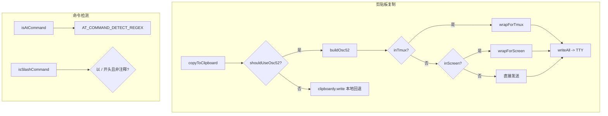

# commandUtils.ts

> 剪贴板复制（支持 OSC-52 远程终端）、URL 打开命令获取、斜杠/@ 命令检测工具

## 概述

本文件聚合了多项命令行 UI 相关的实用功能：
1. **OSC-52 剪贴板复制**：支持 SSH/WSL/tmux/Screen 等远程/多路复用场景下通过终端转义序列复制文本到系统剪贴板；
2. **`@` 命令检测**：判断输入是否包含 `@<路径>` 模式以触发文件预加载；
3. **斜杠命令检测**：判断输入是否为 `/command` 格式（排除 `//` 和 `/*` 注释）；
4. **URL 打开命令**：根据操作系统返回对应的 URL 打开命令（open/start/xdg-open）；
5. **自动执行判断**：判断斜杠命令是否应在选中后自动执行。

## 架构图（mermaid）

## 主要导出

| 导出名 | 类型 | 说明 |
|--------|------|------|
| `isAtCommand` | function | 检测查询是否包含 `@<路径>` 模式 |
| `isSlashCommand` | function | 检测查询是否为斜杠命令 |
| `copyToClipboard` | async function | 智能剪贴板复制（OSC-52 或本地 clipboardy） |
| `getUrlOpenCommand` | function | 返回当前操作系统的 URL 打开命令 |
| `isAutoExecutableCommand` | function | 判断斜杠命令是否应自动执行 |

## 核心逻辑

1. **OSC-52 协议**：`buildOsc52()` 将文本 Base64 编码后包装为 `ESC]52;c;<base64>BEL` 序列，限制最大 100KB。
2. **TTY 选择**：`pickTty()` 优先使用 `/dev/tty`（非 Windows），否则回退到 stderr/stdout。Windows 优先 stdout 避免 PowerShell 颜色干扰。
3. **多路复用包装**：tmux 使用 `ESC Ptmux;...ST` DCS 透传，Screen 以 240 字节分块发送。
4. **安全截断**：`safeUtf8Truncate()` 保证不在 UTF-8 多字节序列中间截断。

## 内部依赖

| 模块 | 说明 |
|------|------|
| `../commands/types.js` | `SlashCommand` 类型 |
| `../hooks/atCommandProcessor.js` | `AT_COMMAND_PATH_REGEX_SOURCE` 正则源 |
| `../../config/settingsSchema.js` | `Settings` 类型 |

## 外部依赖

| 模块 | 说明 |
|------|------|
| `@google/gemini-cli-core` | `debugLogger` |
| `clipboardy` | 本地剪贴板读写回退 |
| `node:fs` | 文件流和同步写入 |
| `node:stream` | `Writable` 类型 |
