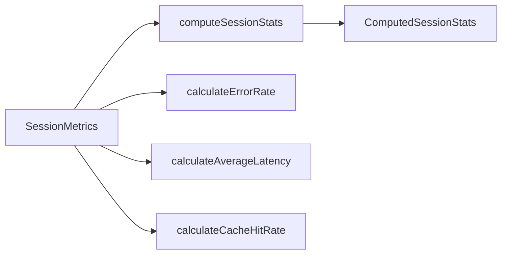

# computeStats.ts

> 计算会话级统计指标：错误率、平均延迟、缓存命中率、工具成功率等

## 概述

本文件提供一组纯函数，用于根据 `SessionMetrics` 数据计算会话的各项统计指标。这些指标驱动 `/stats` 命令的展示面板，包括 API 错误率、平均延迟、token 缓存效率、工具成功率和用户同意率等。

## 架构图（mermaid）

## 主要导出

| 导出名 | 类型 | 说明 |
|--------|------|------|
| `calculateErrorRate` | function | 计算单个模型的 API 错误率（百分比） |
| `calculateAverageLatency` | function | 计算单个模型的平均请求延迟（毫秒） |
| `calculateCacheHitRate` | function | 计算单个模型的缓存命中率（百分比） |
| `computeSessionStats` | function | 汇总整个会话的综合统计数据 |

## 核心逻辑

1. **错误率** = `totalErrors / totalRequests * 100`，零请求时返回 0。
2. **平均延迟** = `totalLatencyMs / totalRequests`。
3. **缓存命中率** = `cachedTokens / promptTokens * 100`。
4. **computeSessionStats** 聚合所有模型数据，计算 API 时间占比、工具时间占比、缓存效率、工具成功率和用户同意率。

## 内部依赖

| 模块 | 说明 |
|------|------|
| `../contexts/SessionContext.js` | `SessionMetrics`、`ComputedSessionStats`、`ModelMetrics` 类型 |

## 外部依赖

无外部第三方依赖。
