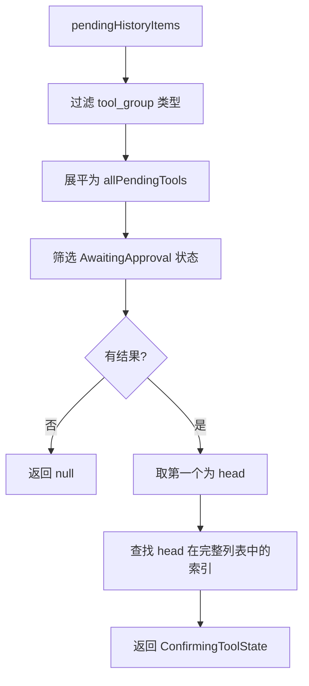

# confirmingTool.ts

> 从待处理历史条目中提取当前需要用户确认的工具调用状态

## 概述

本文件导出 `getConfirmingToolState` 函数，用于从挂起的历史记录中找到第一个处于 `AwaitingApproval` 状态的工具调用。返回该工具的详情及其在全部待处理工具中的位置索引，供确认对话框显示"第 N/M 个工具"。

## 架构图（mermaid）

## 主要导出

| 导出名 | 类型 | 说明 |
|--------|------|------|
| `ConfirmingToolState` | interface | 包含 tool、index（1-based）、total 三个字段 |
| `getConfirmingToolState` | function | 返回当前需确认的工具状态，或 null |

## 核心逻辑

1. 将所有 `tool_group` 类型的挂起条目展平为工具列表。
2. 筛选出 `AwaitingApproval` 状态的工具。
3. 返回队列头部的工具及其在完整列表中的位置。

## 内部依赖

| 模块 | 说明 |
|------|------|
| `../types.js` | `HistoryItemToolGroup`、`HistoryItemWithoutId`、`IndividualToolCallDisplay` 类型 |

## 外部依赖

| 模块 | 说明 |
|------|------|
| `@google/gemini-cli-core` | `CoreToolCallStatus` 枚举 |
