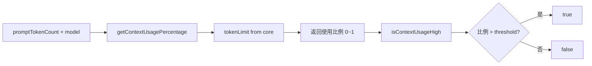

# contextUsage.ts

> 计算并判断当前模型上下文窗口的 token 使用百分比是否过高

## 概述

本文件提供两个简单的工具函数，用于根据当前 prompt token 数量和模型名称计算上下文窗口的使用比例，并判断是否超过阈值。当使用率过高时，UI 可以显示警告提示用户考虑压缩上下文。

## 架构图（mermaid）

## 主要导出

| 导出名 | 类型 | 说明 |
|--------|------|------|
| `getContextUsagePercentage` | function | 返回 0~1 之间的上下文使用比例 |
| `isContextUsageHigh` | function | 判断使用率是否超过阈值（默认 0.6） |

## 核心逻辑

1. 通过 `tokenLimit(model)` 获取模型的上下文窗口大小。
2. 计算 `promptTokenCount / limit` 得到使用比例。
3. 模型名无效或限制为 0 时返回 0。

## 内部依赖

无内部 UI 模块依赖。

## 外部依赖

| 模块 | 说明 |
|------|------|
| `@google/gemini-cli-core` | `tokenLimit` 函数 |
