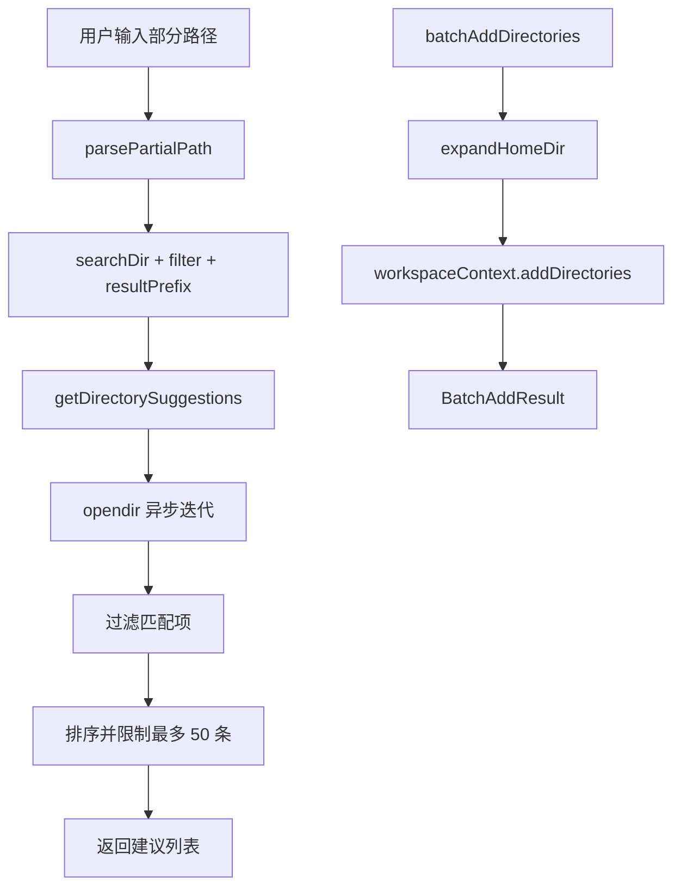

# directoryUtils.ts

> 目录路径补全建议、主目录展开和批量添加工作区目录的工具集

## 概述

本文件为 `/add-dir` 等命令提供目录操作支持：将 `~` 和 `%USERPROFILE%` 展开为实际路径，基于部分路径提供目录自动补全建议（使用异步迭代高效处理大目录），以及批量向工作区上下文添加目录并收集错误信息。

## 架构图（mermaid）

## 主要导出

| 导出名 | 类型 | 说明 |
|--------|------|------|
| `expandHomeDir` | function | 将 `~` 或 `%USERPROFILE%` 展开为实际路径 |
| `getDirectorySuggestions` | async function | 根据部分路径返回目录补全建议列表 |
| `BatchAddResult` | interface | 批量添加结果，包含 added 和 errors |
| `batchAddDirectories` | function | 批量添加目录到工作区上下文 |

## 核心逻辑

1. **路径解析**：`parsePartialPath` 处理空路径、末尾斜杠、`~` 特殊情况，拆分为搜索目录和过滤关键词。
2. **异步目录遍历**：使用 `fs.opendir` 的异步迭代器避免一次性读取全部条目，匹配超过 150 条时提前终止。
3. **隐藏目录**：仅当过滤词以 `.` 开头时才显示隐藏目录。
4. **路径分隔符一致性**：返回结果使用用户输入中的分隔符风格。

## 内部依赖

无直接内部 UI 模块依赖。

## 外部依赖

| 模块 | 说明 |
|------|------|
| `@google/gemini-cli-core` | `homedir`、`WorkspaceContext` |
| `node:path` | 路径操作 |
| `node:fs` | 同步文件系统检查 |
| `node:fs/promises` | `opendir` 异步目录遍历 |
