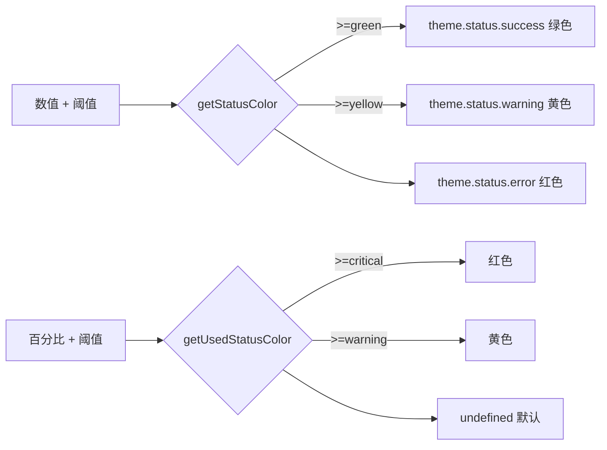

# displayUtils.ts

> 基于阈值的状态颜色选择工具，用于统计面板中的指标着色

## 概述

本文件定义了多组性能指标阈值常量（工具成功率、用户同意率、缓存效率、配额使用率），并提供两个颜色选择函数。`getStatusColor` 根据"越高越好"的逻辑着色，`getUsedStatusColor` 根据"越高越差"的逻辑着色。这些函数驱动 `/stats` 面板中的指标颜色显示。

## 架构图（mermaid）

## 主要导出

| 导出名 | 类型 | 说明 |
|--------|------|------|
| `TOOL_SUCCESS_RATE_HIGH` | const (95) | 工具成功率高阈值 |
| `TOOL_SUCCESS_RATE_MEDIUM` | const (85) | 工具成功率中阈值 |
| `USER_AGREEMENT_RATE_HIGH` | const (75) | 用户同意率高阈值 |
| `USER_AGREEMENT_RATE_MEDIUM` | const (45) | 用户同意率中阈值 |
| `CACHE_EFFICIENCY_HIGH` | const (40) | 缓存效率高阈值 |
| `CACHE_EFFICIENCY_MEDIUM` | const (15) | 缓存效率中阈值 |
| `QUOTA_THRESHOLD_HIGH` | const (20) | 配额剩余高阈值 |
| `QUOTA_THRESHOLD_MEDIUM` | const (5) | 配额剩余中阈值 |
| `QUOTA_USED_WARNING_THRESHOLD` | const (80) | 配额使用率警告阈值 |
| `QUOTA_USED_CRITICAL_THRESHOLD` | const (95) | 配额使用率严重阈值 |
| `getStatusColor` | function | 根据"越高越好"逻辑返回主题颜色 |
| `getUsedStatusColor` | function | 根据"越高越差"逻辑返回主题颜色 |

## 核心逻辑

- `getStatusColor`：值 >= green 阈值返回成功色，>= yellow 返回警告色，否则返回错误色或自定义默认色。
- `getUsedStatusColor`：值 >= critical 返回错误色，>= warning 返回警告色，否则返回 undefined（使用默认色）。

## 内部依赖

| 模块 | 说明 |
|------|------|
| `../semantic-colors.js` | `theme` 语义化主题颜色 |

## 外部依赖

无外部第三方依赖。
