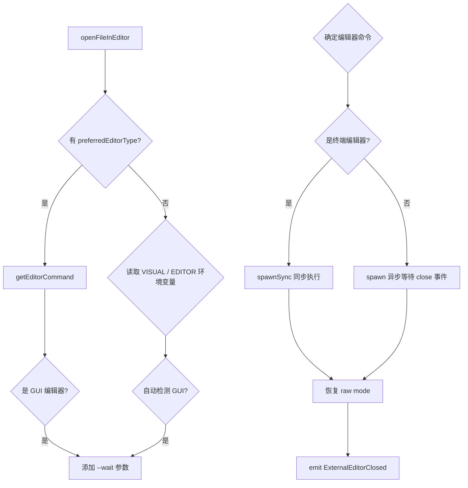

# editorUtils.ts

> 在外部编辑器中打开文件并等待关闭，支持终端编辑器和 GUI 编辑器

## 概述

本文件导出 `openFileInEditor` 函数，用于在用户偏好的外部编辑器中打开指定文件。它自动检测编辑器类型（终端型如 vim/nvim 或 GUI 型如 VS Code/Cursor），终端编辑器使用 `spawnSync` 同步阻塞，GUI 编辑器使用 `spawn` 异步等待，并在编辑器运行期间正确管理 stdin 的 raw mode 状态。

## 架构图（mermaid）

## 主要导出

| 导出名 | 类型 | 说明 |
|--------|------|------|
| `openFileInEditor` | async function | 在外部编辑器中打开文件并等待其关闭 |

## 核心逻辑

1. **编辑器选择优先级**：`preferredEditorType` 配置 > `VISUAL` 环境变量 > `EDITOR` 环境变量 > 默认（Windows: notepad, 其他: vi）。
2. **--wait 参数**：GUI 编辑器（code/cursor/subl/zed/atom）自动添加 `--wait` 或 `-w` 参数以阻塞直到文件关闭。
3. **vim 特殊处理**：为 vi/vim/nvim 添加 `-i NONE` 参数防止 viminfo 写入错误。
4. **raw mode 管理**：编辑器启动前关闭 raw mode，退出后恢复，确保终端编辑器可以正常交互。

## 内部依赖

无直接内部 UI 模块依赖。

## 外部依赖

| 模块 | 说明 |
|------|------|
| `@google/gemini-cli-core` | `coreEvents`、`CoreEvent`、`getEditorCommand`、`isGuiEditor`、`isTerminalEditor`、`EditorType` |
| `node:child_process` | `spawn`、`spawnSync` |
| `node:tty` | `ReadStream` 类型 |
