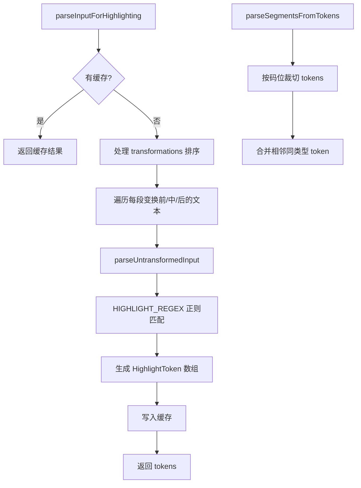

# highlight.ts

> 输入框文本语法高亮解析器，识别斜杠命令、@文件引用和粘贴占位符

## 概述

本文件为输入组件提供文本高亮解析功能。它将用户输入文本解析为带有类型标注的 token 序列（`default`/`command`/`file`/`paste`），供 UI 层用不同颜色渲染。支持 LRU 缓存以优化性能，并正确处理文本缩略变换（transformation）中的折叠/展开状态。

## 架构图（mermaid）

## 主要导出

| 导出名 | 类型 | 说明 |
|--------|------|------|
| `HighlightToken` | type | 包含 text 和 type 的高亮标记 |
| `parseInputForHighlighting` | function | 解析输入文本生成高亮 token 序列 |
| `parseSegmentsFromTokens` | function | 从 token 序列中按码位范围裁切子段 |

## 核心逻辑

1. **正则匹配**：`HIGHLIGHT_REGEX` 同时匹配 `/command`、`@file/path`、`[Pasted Text: N lines]` 三种模式。
2. **缓存策略**：基于行索引、光标位置和文本内容生成 cacheKey，使用 LRU 缓存加速重复解析。
3. **变换处理**：遍历排序后的 transformation 列表，变换区域内的文本根据光标是否在内部决定显示完整路径还是折叠形式。
4. **码位级裁切**：`parseSegmentsFromTokens` 使用 `cpLen/cpSlice` 在 Unicode 码位级别精确裁切，正确处理 emoji 等多字节字符。

## 内部依赖

| 模块 | 说明 |
|------|------|
| `../components/shared/text-buffer.js` | `Transformation` 类型、`PASTED_TEXT_PLACEHOLDER_REGEX` |
| `./textUtils.js` | `cpLen`、`cpSlice` Unicode 工具 |
| `../constants.js` | `LRU_BUFFER_PERF_CACHE_LIMIT` 缓存大小限制 |
| `../hooks/atCommandProcessor.js` | `AT_COMMAND_PATH_REGEX_SOURCE` 正则源 |

## 外部依赖

| 模块 | 说明 |
|------|------|
| `mnemonist` | `LRUCache` 高性能缓存 |
