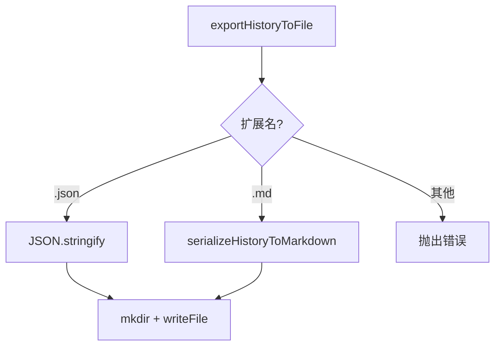

# historyExportUtils.ts

> 将聊天历史序列化为 Markdown 或 JSON 并导出到文件

## 概述

本文件提供聊天历史的导出功能。`serializeHistoryToMarkdown` 将 Gemini API 的 `Content` 数组转换为带角色标题和分隔线的 Markdown 文本（包括工具调用和工具响应的 JSON 代码块），`exportHistoryToFile` 根据文件扩展名自动选择 JSON 或 Markdown 格式写入磁盘。

## 架构图（mermaid）

## 主要导出

| 导出名 | 类型 | 说明 |
|--------|------|------|
| `serializeHistoryToMarkdown` | function | 将 Content 数组序列化为 Markdown 字符串 |
| `ExportHistoryOptions` | interface | 导出选项，包含 history 和 filePath |
| `exportHistoryToFile` | async function | 将聊天历史导出到文件（支持 .json 和 .md） |

## 核心逻辑

1. **Markdown 序列化**：每条消息以 `## ROLE` 标题开头，`functionCall` 和 `functionResponse` 渲染为 JSON 代码块，消息间用 `---` 分隔。
2. **自动创建目录**：`exportHistoryToFile` 会递归创建输出路径的父目录。
3. **格式限制**：仅支持 `.json` 和 `.md` 两种格式，其他扩展名抛出异常。

## 内部依赖

无直接内部 UI 模块依赖。

## 外部依赖

| 模块 | 说明 |
|------|------|
| `@google/genai` | `Content` 类型（Gemini API 消息格式） |
| `node:fs/promises` | 异步文件操作 |
| `node:path` | 路径和扩展名处理 |
