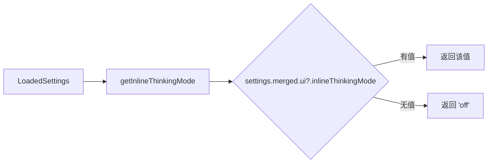

# inlineThinkingMode.ts

> 从用户设置中读取内联思考模式（off/full）的配置

## 概述

本文件导出一个简单的配置读取函数，从已加载的设置中提取内联思考模式。该模式控制是否在 UI 中显示模型的思考过程。默认值为 `'off'`。

## 架构图（mermaid）

## 主要导出

| 导出名 | 类型 | 说明 |
|--------|------|------|
| `InlineThinkingMode` | type | `'off' \| 'full'` 联合类型 |
| `getInlineThinkingMode` | function | 从设置中获取内联思考模式 |

## 核心逻辑

直接读取 `settings.merged.ui?.inlineThinkingMode`，使用 `??` 运算符提供默认值 `'off'`。

## 内部依赖

| 模块 | 说明 |
|------|------|
| `../../config/settings.js` | `LoadedSettings` 类型 |

## 外部依赖

无外部第三方依赖。
