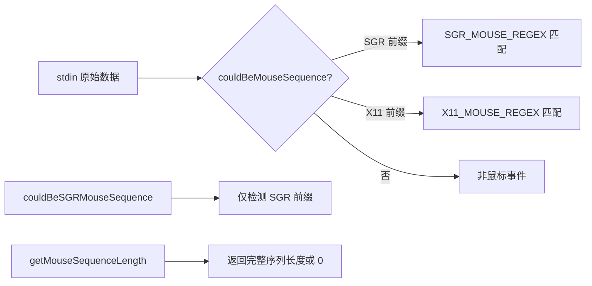

# input.ts

> 终端输入流中鼠标事件转义序列的常量定义与前缀检测工具

## 概述

本文件定义了 SGR 和 X11 两种鼠标事件编码格式的转义序列前缀、正则表达式和辅助检测函数。这些工具用于输入处理管线中识别原始 stdin 数据中是否包含（或可能包含）鼠标事件序列，从而将其与普通键盘输入区分开来。

## 架构图（mermaid）

## 主要导出

| 导出名 | 类型 | 说明 |
|--------|------|------|
| `ESC` | const | ESC 转义字符 `\u001B` |
| `SGR_EVENT_PREFIX` | const | SGR 鼠标事件前缀 `ESC[<` |
| `X11_EVENT_PREFIX` | const | X11 鼠标事件前缀 `ESC[M` |
| `SGR_MOUSE_REGEX` | RegExp | SGR 鼠标事件完整匹配正则 |
| `X11_MOUSE_REGEX` | RegExp | X11 鼠标事件完整匹配正则 |
| `couldBeSGRMouseSequence` | function | 判断缓冲区是否可能是 SGR 鼠标序列的前缀 |
| `couldBeMouseSequence` | function | 判断缓冲区是否可能是任意鼠标序列的前缀 |
| `getMouseSequenceLength` | function | 返回缓冲区开头完整鼠标序列的长度，无匹配返回 0 |

## 核心逻辑

1. **SGR 格式**：`ESC[<buttonCode;col;row[mM]`，以 `m`（释放）或 `M`（按下）结尾。
2. **X11 格式**：`ESC[M` 后跟 3 个字节（button、col、row 各一个）。
3. **前缀检测**：通过 `startsWith` 双向检查判断缓冲区是否为序列前缀或正在接收序列。

## 内部依赖

无内部 UI 模块依赖。

## 外部依赖

无外部第三方依赖。
