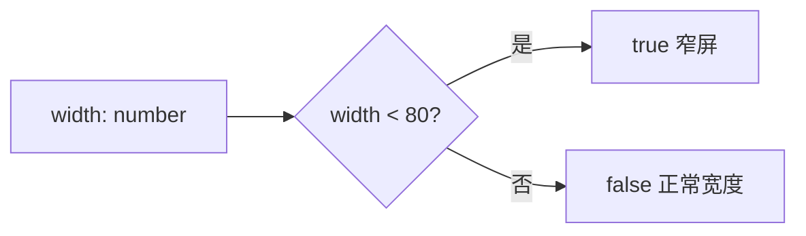

# isNarrowWidth.ts

> 判断终端宽度是否为窄屏（小于 80 列）

## 概述

本文件导出一个极简的宽度判断函数，当终端宽度小于 80 列时返回 `true`。供 UI 组件根据终端宽度调整布局策略（如省略装饰、缩短文本等）。

## 架构图（mermaid）

## 主要导出

| 导出名 | 类型 | 说明 |
|--------|------|------|
| `isNarrowWidth` | function | 判断给定宽度是否小于 80 |

## 核心逻辑

简单比较：`width < 80`。

## 内部依赖

无。

## 外部依赖

无。
