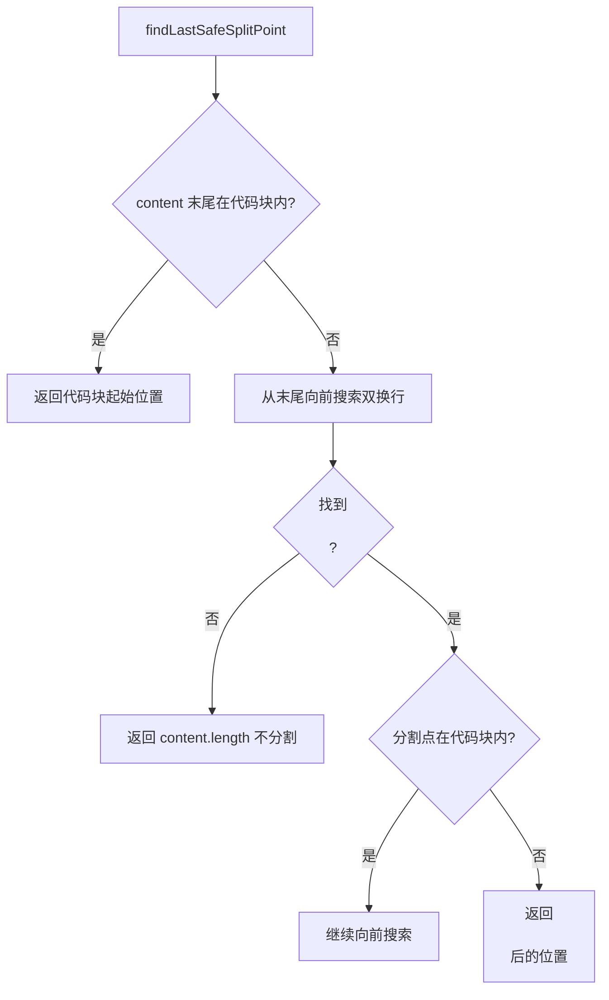

# markdownUtilities.ts

> 在 Markdown 流式内容中寻找安全的分割点，确保不破坏代码块格式

## 概述

本文件解决流式 Markdown 内容分片显示的难题。当 LLM 输出的 Markdown 内容过长需要拆分为多个 UI 消息气泡时，不能在代码块（\`\`\`）内部或 Markdown 块级结构中间截断。`findLastSafeSplitPoint` 函数从内容末尾向前搜索，找到一个既不在代码块内部、又位于段落边界（双换行符 `\n\n`）的安全分割点。

## 架构图（mermaid）

## 主要导出

| 导出名 | 类型 | 说明 |
|--------|------|------|
| `findLastSafeSplitPoint` | function | 从内容末尾找到最佳安全分割点的索引 |

## 核心逻辑

1. **代码块检测**：`isIndexInsideCodeBlock` 通过计数 \`\`\` 出现次数（奇数次 = 在代码块内）判断索引是否在代码块中。
2. **代码块起始定位**：`findEnclosingCodeBlockStart` 精确找到包含指定索引的代码块起始位置。
3. **安全分割**：优先在段落边界分割（`\n\n` 之后），同时确保分割点不在代码块内。如果找不到安全点则返回 `content.length`（不分割）。

## 内部依赖

无内部 UI 模块依赖。

## 外部依赖

无外部第三方依赖。
