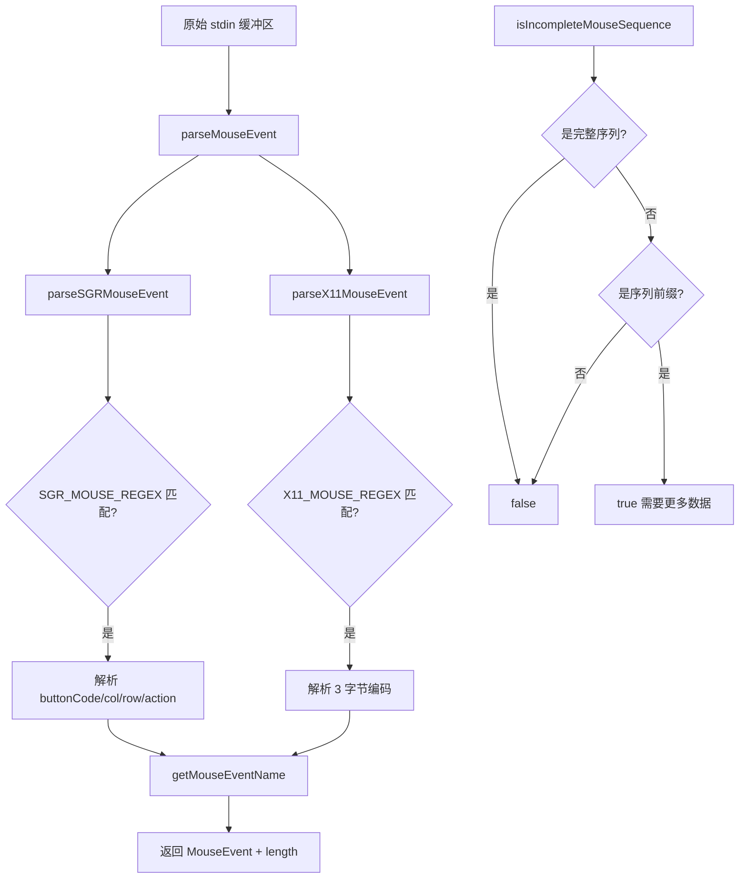

# mouse.ts

> 终端鼠标事件解析器，支持 SGR 和 X11 编码格式的完整事件解析

## 概述

本文件实现了终端鼠标事件的完整解析管线。从原始转义序列中解析出鼠标事件类型（点击、释放、滚轮、移动、双击）、按钮信息、修饰键状态和坐标位置。支持 SGR（现代终端标准，支持大于 223 的坐标）和 X11（传统编码）两种格式。

## 架构图（mermaid）

## 主要导出

| 导出名 | 类型 | 说明 |
|--------|------|------|
| `MouseEventName` | type | 鼠标事件名称联合类型（12 种事件） |
| `DOUBLE_CLICK_THRESHOLD_MS` | const (400) | 双击时间阈值 |
| `DOUBLE_CLICK_DISTANCE_TOLERANCE` | const (2) | 双击位置容差 |
| `MouseEvent` | interface | 鼠标事件对象（name/col/row/shift/meta/ctrl/button） |
| `MouseHandler` | type | 鼠标事件处理函数类型 |
| `getMouseEventName` | function | 从 buttonCode 推断事件名称 |
| `parseSGRMouseEvent` | function | 解析 SGR 格式鼠标事件 |
| `parseX11MouseEvent` | function | 解析 X11 格式鼠标事件 |
| `parseMouseEvent` | function | 统一解析入口，优先 SGR 回退 X11 |
| `isIncompleteMouseSequence` | function | 判断缓冲区是否包含不完整的鼠标序列 |
| `enableMouseEvents` | re-export | 启用终端鼠标事件上报 |
| `disableMouseEvents` | re-export | 禁用终端鼠标事件上报 |

## 核心逻辑

1. **buttonCode 解析**：通过位运算提取修饰键（bit 2=Shift, bit 3=Meta, bit 4=Ctrl）、移动标志（bit 5）、滚轮标志（bit 6）和按钮编号（bit 0-1）。
2. **SGR vs X11**：SGR 以 `m`/`M` 字符结尾区分释放/按下；X11 使用 button code 3 表示通用释放。
3. **不完整序列检测**：用于输入缓冲管线中判断是否需要等待更多数据才能完成解析。

## 内部依赖

| 模块 | 说明 |
|------|------|
| `./input.js` | 鼠标序列正则和前缀常量 |

## 外部依赖

| 模块 | 说明 |
|------|------|
| `@google/gemini-cli-core` | `enableMouseEvents`、`disableMouseEvents` |
