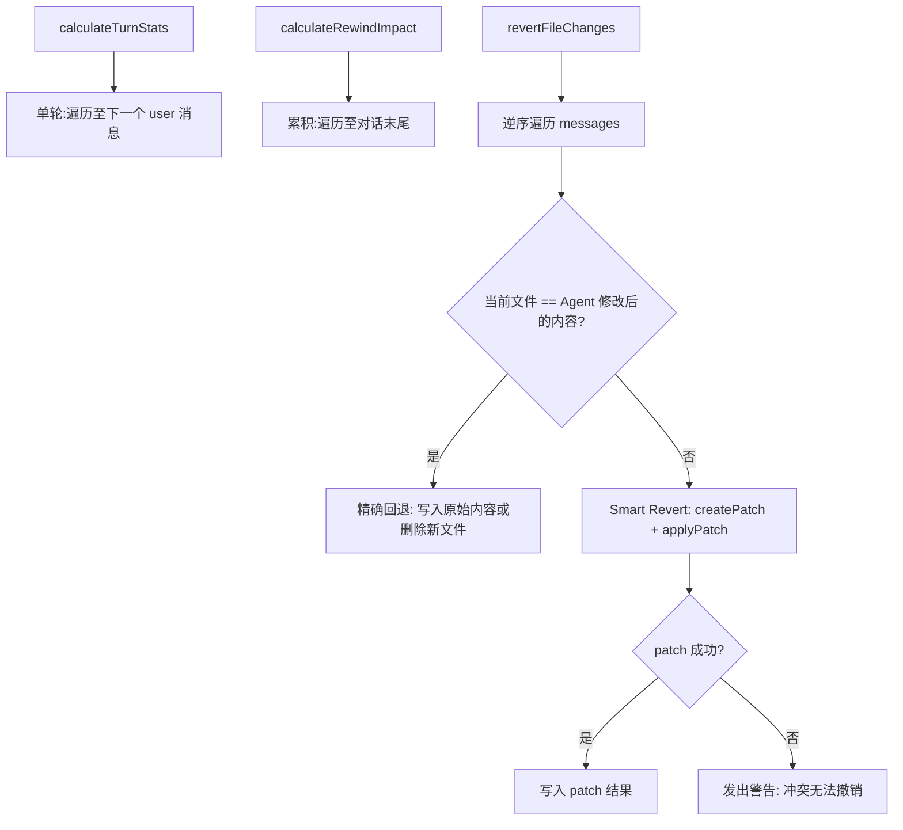

# rewindFileOps.ts

> 对话回退（Rewind）功能的文件操作层：计算变更统计与智能撤销文件修改

## 概述

本文件是 Rewind 功能的核心实现，提供三个主要能力：
1. **单轮统计**：计算一次用户提问后模型所做的文件变更行数和文件数。
2. **累积影响评估**：计算从某条消息到对话末尾所有文件变更的累积统计。
3. **智能文件撤销**：按逆序遍历对话历史，使用 `diff` 库的 patch 机制实现"Smart Revert"——即使文件在 Agent 修改后又被用户手动编辑过，也能尝试正确撤销。

## 架构图（mermaid）

## 主要导出

| 导出名 | 类型 | 说明 |
|--------|------|------|
| `FileChangeDetail` | interface | 文件变更详情（文件名 + diff 文本） |
| `FileChangeStats` | interface | 文件变更统计（增删行数、文件数） |
| `calculateTurnStats` | function | 计算单轮文件变更统计 |
| `calculateRewindImpact` | function | 计算从指定消息到对话末尾的累积变更统计 |
| `revertFileChanges` | async function | 按逆序撤销文件变更，支持智能合并冲突处理 |

## 核心逻辑

1. **变更提取**：通过 `getFileDiffFromResultDisplay` 从工具调用结果中提取文件 diff 信息。
2. **精确回退**：文件内容与 Agent 写入内容完全匹配时，直接恢复原始内容或删除新建文件。
3. **Smart Revert**：内容不匹配时，使用 `Diff.createPatch(Agent内容 -> 原始内容)` 生成撤销补丁，再用 `Diff.applyPatch(当前内容, 补丁)` 应用到当前文件。
4. **逆序处理**：从对话末尾向目标消息方向遍历，确保后续修改先被撤销。

## 内部依赖

无直接内部 UI 模块依赖。

## 外部依赖

| 模块 | 说明 |
|------|------|
| `@google/gemini-cli-core` | `ConversationRecord`、`MessageRecord`、`coreEvents`、`debugLogger`、`getFileDiffFromResultDisplay`、`computeModelAddedAndRemovedLines` |
| `node:fs/promises` | 异步文件读写和删除 |
| `diff` | diff 和 patch 算法库 |
