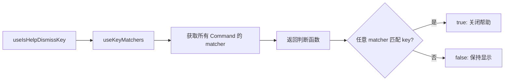

# shortcutsHelp.ts

> 帮助面板关闭按键检测 Hook，匹配任意已注册的命令快捷键

## 概述

本文件导出一个 React Hook `useIsHelpDismissKey`，用于判断用户按下的键是否应该关闭帮助/快捷键面板。它的逻辑是：任何已注册的命令快捷键都可以关闭帮助面板，这样用户在查看帮助时可以直接按快捷键执行操作并同时关闭面板。

## 架构图（mermaid）

## 主要导出

| 导出名 | 类型 | 说明 |
|--------|------|------|
| `useIsHelpDismissKey` | function (Hook) | 返回一个函数，判断按键是否应关闭帮助面板 |

## 核心逻辑

遍历 `Command` 枚举中的所有命令，检查按键是否匹配其中任意一个。使用 `Object.values(Command).some()` 实现"任意命令匹配即关闭"的语义。

## 内部依赖

| 模块 | 说明 |
|------|------|
| `../key/keyMatchers.js` | `Command` 枚举 |
| `../hooks/useKeypress.js` | `Key` 类型 |
| `../hooks/useKeyMatchers.js` | `useKeyMatchers` Hook |

## 外部依赖

无外部第三方依赖。
