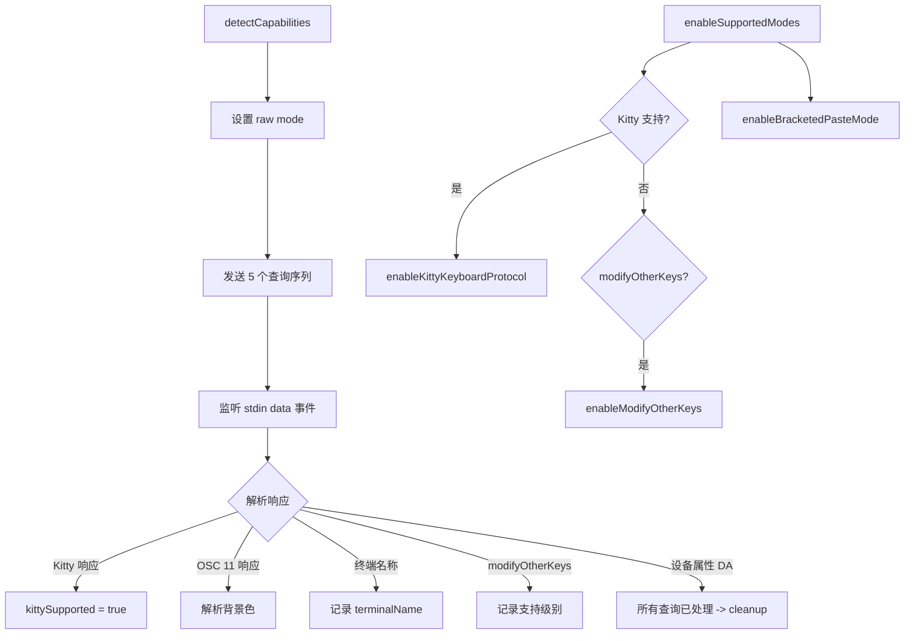

# terminalCapabilityManager.ts

> 终端能力检测与键盘协议管理器，检测 Kitty 协议、背景色、终端名称等

## 概述

本文件实现了 `TerminalCapabilityManager` 单例类，在应用启动时通过向终端发送一系列查询转义序列（Kitty 键盘协议、OSC 11 背景色、终端名称/版本、modifyOtherKeys、设备属性）来探测终端能力。检测完成后可以启用支持的键盘协议模式。同时提供 `cleanupTerminalOnExit` 函数确保应用退出时正确恢复终端状态。

## 架构图（mermaid）

## 主要导出

| 导出名 | 类型 | 说明 |
|--------|------|------|
| `TerminalBackgroundColor` | type | `string \| undefined` |
| `cleanupTerminalOnExit` | function | 退出时恢复终端状态的清理函数 |
| `TerminalCapabilityManager` | class | 终端能力检测与管理单例 |
| `terminalCapabilityManager` | const | 全局单例实例 |

## 核心逻辑

1. **查询序列**：通过 `fs.writeSync` 直接向 stdout fd 写入转义序列，使用隐藏模式防止字符泄漏到屏幕。
2. **哨兵机制**：设备属性查询（DA）作为最后发送的序列，其响应表示终端已处理完所有前置查询。
3. **超时保护**：1 秒超时确保即使终端不响应也不会阻塞启动。
4. **退出清理**：`cleanupTerminalOnExit` 优先使用同步写入（`fs.writeSync`）发送预编码的清理序列，确保在 SIGTERM/SIGINT 等信号下也能正确恢复。
5. **OSC 9 通知支持检测**：根据终端名称判断是否支持 OSC 9 桌面通知。

## 内部依赖

| 模块 | 说明 |
|------|------|
| `../themes/color-utils.js` | `parseColor` 解析 OSC 11 背景色响应 |

## 外部依赖

| 模块 | 说明 |
|------|------|
| `@google/gemini-cli-core` | `debugLogger`、键盘协议启用/禁用函数、粘贴模式函数 |
| `node:fs` | 同步文件写入 |
