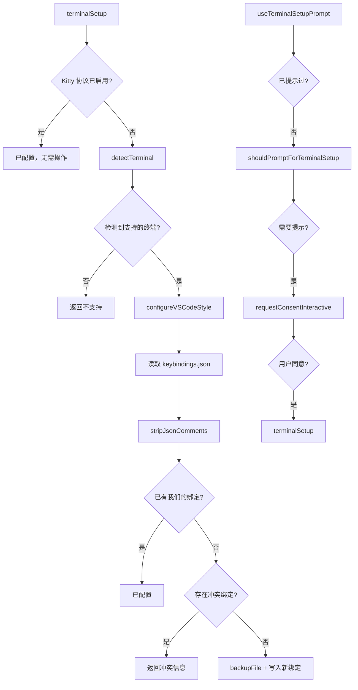

# terminalSetup.ts

> 自动检测并配置 VS Code 系列终端的 Shift+Enter/Ctrl+Enter 多行输入快捷键

## 概述

本文件是 `/terminal-setup` 命令的核心实现，提供从终端检测到配置写入的完整流程。支持 VS Code、Cursor、Windsurf、Antigravity 四种终端，通过修改其 `keybindings.json` 文件添加 Shift+Enter 和 Ctrl+Enter 的快捷键绑定（发送 `\\\r\n` 序列用于多行输入）以及 Cmd/Alt+Z 的撤销快捷键。包含冲突检测、文件备份和用户同意流程。

## 架构图（mermaid）

## 主要导出

| 导出名 | 类型 | 说明 |
|--------|------|------|
| `VSCODE_SHIFT_ENTER_SEQUENCE` | const | VS Code 多行输入序列 `\\\r\n` |
| `TerminalSetupResult` | interface | 设置结果（success/message/requiresRestart） |
| `getTerminalProgram` | function | 从环境变量检测当前终端类型 |
| `shouldPromptForTerminalSetup` | async function | 判断是否应提示用户运行终端设置 |
| `terminalSetup` | async function | 执行终端配置的主函数 |
| `TERMINAL_SETUP_CONSENT_MESSAGE` | const | 用户同意提示消息 |
| `formatTerminalSetupResultMessage` | function | 格式化设置结果消息 |
| `useTerminalSetupPrompt` | function (Hook) | 首次使用时自动提示终端设置的 React Hook |

## 核心逻辑

1. **终端检测**：优先通过环境变量（`TERM_PROGRAM`、`CURSOR_TRACE_ID`、`VSCODE_GIT_ASKPASS_MAIN`）检测，回退到检查父进程名。VS Code forks 优先于 VS Code 检测以避免误判。
2. **配置目录**：macOS 使用 `~/Library/Application Support/<App>/User`，Windows 使用 `%APPDATA%/<App>/User`，Linux 使用 `~/.config/<App>/User`。
3. **JSON 注释处理**：VS Code 的 JSON 配置文件允许注释，使用 `stripJsonComments` 在解析前去除。
4. **冲突检测**：如果已存在同名快捷键但不是我们的绑定，则拒绝修改并提示用户手动处理。
5. **一次性提示**：`useTerminalSetupPrompt` Hook 使用 `persistentState` 确保每个用户只提示一次。

## 内部依赖

| 模块 | 说明 |
|------|------|
| `./terminalCapabilityManager.js` | 检查 Kitty 协议是否已启用 |
| `../../utils/persistentState.js` | 持久化状态存储（记录是否已提示） |
| `../../config/extensions/consent.js` | `requestConsentInteractive` 用户同意流程 |
| `../types.js` | `ConfirmationRequest` 类型 |
| `../hooks/useHistoryManager.js` | `UseHistoryManagerReturn` 类型 |

## 外部依赖

| 模块 | 说明 |
|------|------|
| `@google/gemini-cli-core` | `debugLogger`、`homedir` |
| `node:fs` | promises API 文件操作 |
| `node:os` | 平台检测 |
| `node:path` | 路径拼接 |
| `node:child_process` | `exec` 检查父进程 |
| `node:util` | `promisify` |
| `react` | `useEffect` Hook |
