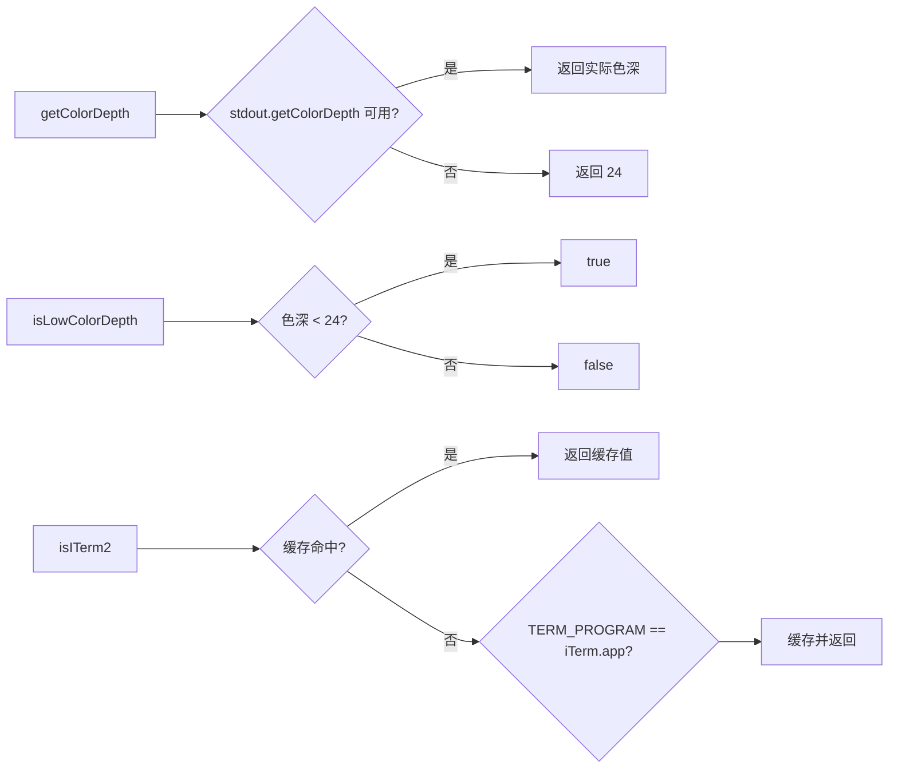

# terminalUtils.ts

> 终端颜色深度检测和 iTerm2 终端识别工具

## 概述

本文件提供三个简单的终端环境检测函数：获取终端颜色深度（默认 24 位真彩色）、判断是否为低色深终端（低于 24 位，如 256 色或 16 色终端）、以及检测当前是否在 iTerm2 中运行。iTerm2 检测结果会被缓存以避免重复读取环境变量。

## 架构图（mermaid）

## 主要导出

| 导出名 | 类型 | 说明 |
|--------|------|------|
| `getColorDepth` | function | 返回终端颜色深度（位数），未知时返回 24 |
| `isLowColorDepth` | function | 判断终端是否低于 24 位色深 |
| `isITerm2` | function | 检测当前终端是否为 iTerm2 |
| `resetITerm2Cache` | function | 重置 iTerm2 检测缓存（测试用） |

## 核心逻辑

- `getColorDepth`：调用 `process.stdout.getColorDepth()` Node.js 内置 API，不可用时降级为 24。
- `isITerm2`：检查 `TERM_PROGRAM` 环境变量是否等于 `iTerm.app`，结果缓存在模块级变量中。

## 内部依赖

无内部 UI 模块依赖。

## 外部依赖

| 模块 | 说明 |
|------|------|
| `node:process` | 进程和 stdout 访问 |
