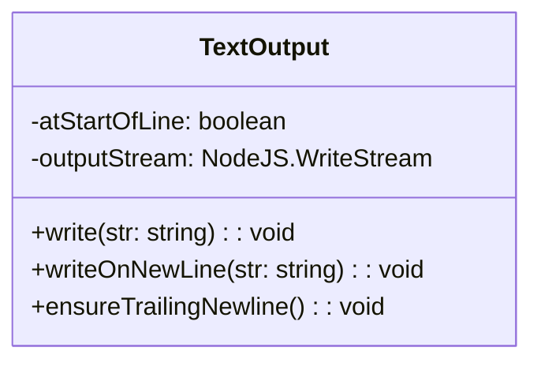

# textOutput.ts

> 管理 stdout 文本写入的工具类，确保换行符一致性

## 概述

`TextOutput` 类封装了 `process.stdout` 的写入操作，通过跟踪"是否在行首"状态来提供智能换行管理。`writeOnNewLine` 在需要时自动补充换行符避免内容粘连，`ensureTrailingNewline` 确保输出以换行结尾。所有状态判断基于去除 ANSI 转义码后的文本内容。

## 架构图（mermaid）

## 主要导出

| 导出名 | 类型 | 说明 |
|--------|------|------|
| `TextOutput` | class | 带换行状态跟踪的 stdout 写入器 |

## 核心逻辑

1. **状态跟踪**：`atStartOfLine` 标记当前光标是否在行首，通过 `stripAnsi` 去除颜色码后检查末尾字符。
2. **writeOnNewLine**：如果上次输出未以换行结尾，先写入 `\n` 再写内容，避免多余空行。
3. **ensureTrailingNewline**：仅在不在行首时补充换行。

## 内部依赖

无内部 UI 模块依赖。

## 外部依赖

| 模块 | 说明 |
|------|------|
| `strip-ansi` | 去除 ANSI 转义序列 |
