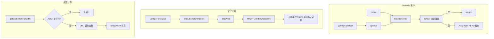

# textUtils.ts

> Unicode 码位级文本处理工具集：宽度计算、安全字符过滤、ANSI 转义清理

## 概述

本文件是整个 UI 层最基础的文本处理工具库，提供以下核心能力：
1. **Unicode 码位操作**：正确处理 emoji 等代理对字符的长度计算和切片。
2. **终端宽度计算**：带 LRU 缓存的 `stringWidth` 封装，包含 ASCII 快速路径。
3. **安全字符过滤**：移除可能破坏终端渲染的控制字符、BiDi 字符和零宽字符。
4. **ANSI 转义码处理**：递归遍历 JSON 结构，转义所有嵌套字符串中的 ANSI 控制码。

## 架构图（mermaid）

## 主要导出

| 导出名 | 类型 | 说明 |
|--------|------|------|
| `getAsciiArtWidth` | function | 计算 ASCII art 多行文本的最大宽度 |
| `isAscii` | function | 判断字符串是否全为 ASCII 字符 |
| `toCodePoints` | function | 将字符串拆分为码位数组（带缓存） |
| `cpLen` | function | 返回字符串的码位长度 |
| `cpIndexToOffset` | function | 将码位索引转为 UTF-16 偏移量 |
| `cpSlice` | function | 按码位索引切片字符串 |
| `stripUnsafeCharacters` | function | 移除不安全的控制字符和零宽字符 |
| `sanitizeForDisplay` | function | 清理并截断字符串用于 UI 显示 |
| `normalizeEscapedNewlines` | function | 将 `\\n` 和 `\\r\\n` 转为实际换行符 |
| `getCachedStringWidth` | function | 带 LRU 缓存的终端显示宽度计算 |
| `escapeAnsiCtrlCodes` | function | 递归转义 JSON 结构中所有字符串的 ANSI 控制码 |

## 核心逻辑

1. **ASCII 快速路径**：`isAscii` 通过逐字符检查 charCode <= 127 实现，避免 ASCII 文本触发正则/Array.from 开销。
2. **码位缓存**：短于 1000 字符的非 ASCII 字符串使用 LRU 缓存码位数组。
3. **宽度计算容错**：`getCachedStringWidth` 捕获 `string-width` 库的崩溃（如 U+0602 字符），回退到码位数。
4. **Copy-on-Write ANSI 转义**：`escapeAnsiCtrlCodes` 仅在发现需要转义的字符串时才创建新对象，最大化内存复用。

## 内部依赖

| 模块 | 说明 |
|------|------|
| `../constants.js` | `LRU_BUFFER_PERF_CACHE_LIMIT` 缓存大小限制 |

## 外部依赖

| 模块 | 说明 |
|------|------|
| `strip-ansi` | 移除 ANSI 转义序列 |
| `ansi-regex` | ANSI 转义序列正则 |
| `node:util` | `stripVTControlCharacters` |
| `string-width` | 终端显示宽度计算 |
| `mnemonist` | `LRUCache` 高性能缓存 |
