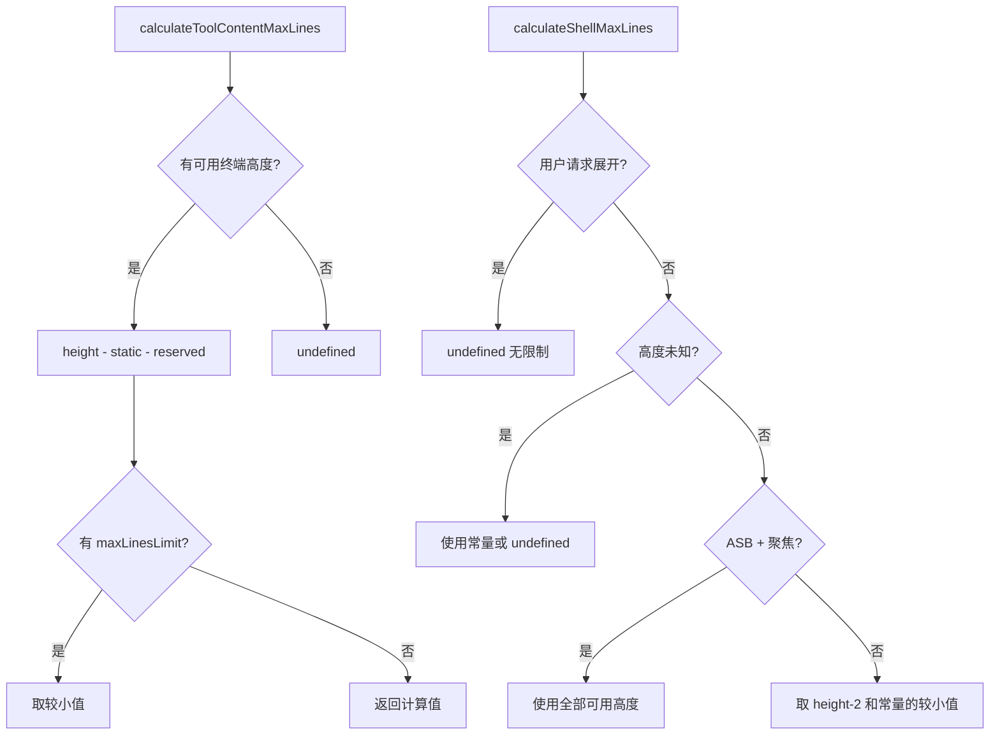

# toolLayoutUtils.ts

> 工具结果和 Shell 输出的显示行数计算工具，适配交替屏幕缓冲区和标准模式

## 概述

本文件提供两个布局计算函数，用于确定工具调用结果和 Shell 命令输出在终端中可显示的最大行数。计算逻辑综合考虑终端可用高度、交替屏幕缓冲区（ASB）模式的额外预留空间、Shell 焦点状态和用户展开请求等因素。这些常量和函数必须在 `ToolGroupMessage` 和 `ToolResultDisplay` 之间保持同步。

## 架构图（mermaid）

## 主要导出

| 导出名 | 类型 | 说明 |
|--------|------|------|
| `TOOL_RESULT_STATIC_HEIGHT` | const (1) | 工具消息静态高度（名称/状态行） |
| `TOOL_RESULT_ASB_RESERVED_LINE_COUNT` | const (6) | ASB 模式预留行数 |
| `TOOL_RESULT_STANDARD_RESERVED_LINE_COUNT` | const (2) | 标准模式预留行数 |
| `TOOL_RESULT_MIN_LINES_SHOWN` | const (2) | 最少显示行数 |
| `SHELL_CONTENT_OVERHEAD` | const (3) | Shell UI 元素占用的行数 |
| `calculateToolContentMaxLines` | function | 计算工具结果内容可显示的最大行数 |
| `calculateShellMaxLines` | function | 计算 Shell 输出可显示的最大行数 |

## 核心逻辑

1. **工具内容高度**：可用高度减去静态高度和预留行数，确保不低于最低显示行数。
2. **Shell 高度**：
   - 用户展开（`!constrainHeight && isExpandable`）时无限制。
   - ASB 聚焦模式下使用全部终端高度。
   - 其他情况取终端高度和进程状态常量（活跃/已完成）的较小值。

## 内部依赖

| 模块 | 说明 |
|------|------|
| `../constants.js` | `ACTIVE_SHELL_MAX_LINES`、`COMPLETED_SHELL_MAX_LINES` |

## 外部依赖

| 模块 | 说明 |
|------|------|
| `@google/gemini-cli-core` | `CoreToolCallStatus` 枚举 |
