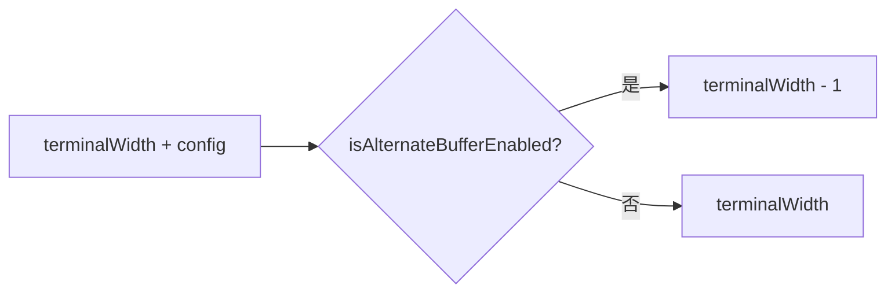

# ui-sizing.ts

> 计算主内容区域宽度，根据是否启用交替屏幕缓冲区调整

## 概述

本文件导出一个简单的布局计算函数，用于确定主内容区域的宽度。当启用交替屏幕缓冲区（ASB）模式时，减去 1 列以为滚动条或边框预留空间；标准模式下使用完整终端宽度。

## 架构图（mermaid）

## 主要导出

| 导出名 | 类型 | 说明 |
|--------|------|------|
| `calculateMainAreaWidth` | function | 根据 ASB 配置计算主内容区域宽度 |

## 核心逻辑

调用 `isAlternateBufferEnabled(config)` 判断是否启用 ASB 模式，是则宽度减 1。

## 内部依赖

| 模块 | 说明 |
|------|------|
| `../hooks/useAlternateBuffer.js` | `isAlternateBufferEnabled` 函数 |

## 外部依赖

| 模块 | 说明 |
|------|------|
| `@google/gemini-cli-core` | `Config` 类型 |
