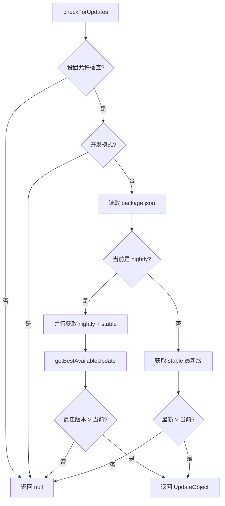

# updateCheck.ts

> 检查 Gemini CLI 是否有新版本可用，支持 nightly 和 stable 双通道

## 概述

本文件实现了应用启动时的版本更新检查逻辑。它从 npm registry 获取最新版本号，与当前版本比较，如果有更新则返回更新信息。对于 nightly 用户，同时检查 nightly 和 stable 两个通道，选择最佳更新版本。更新检查可以通过设置禁用，开发模式下也会跳过。

## 架构图（mermaid）

## 主要导出

| 导出名 | 类型 | 说明 |
|--------|------|------|
| `FETCH_TIMEOUT_MS` | const (2000) | 获取超时时间 |
| `UpdateInfo` | interface | 更新信息（latest/current/name/type） |
| `UpdateObject` | interface | 更新对象（message + UpdateInfo） |
| `checkForUpdates` | async function | 检查并返回可用更新，或 null |

## 核心逻辑

1. **双通道策略**：nightly 用户同时查询 nightly 和 stable 两个版本标签。
2. **最佳版本选择**：`getBestAvailableUpdate` 在基础版本相同时优先选择 nightly，否则选择较高版本。
3. **版本比较**：使用 `semver.gt()` 严格比较，`semver.diff()` 确定更新类型（major/minor/patch）。
4. **错误容忍**：整个检查过程在 try-catch 中执行，网络错误等异常不会影响应用启动。

## 内部依赖

| 模块 | 说明 |
|------|------|
| `../../config/settings.js` | `LoadedSettings` 类型 |

## 外部依赖

| 模块 | 说明 |
|------|------|
| `latest-version` | 从 npm registry 获取最新版本号 |
| `semver` | 语义化版本比较和解析 |
| `@google/gemini-cli-core` | `getPackageJson`、`debugLogger` |
| `node:url` | `fileURLToPath` |
| `node:path` | 路径操作 |
