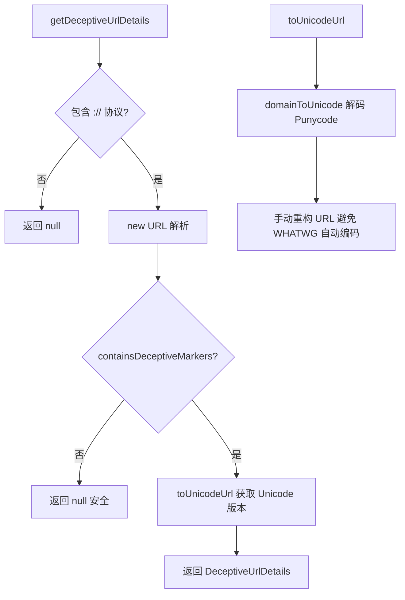

# urlSecurityUtils.ts

> URL 安全检测工具：识别 IDN 同形异义词攻击（Punycode 欺骗性 URL）

## 概述

本文件提供 URL 安全检测功能，用于识别利用国际化域名（IDN）进行的同形异义词攻击。当 URL 的主机名包含非 ASCII 字符或 Punycode 编码（`xn--` 前缀）时，它可能在视觉上模仿合法域名（如用西里尔字母 `а` 替代拉丁字母 `a`）。本工具提取 Unicode 和 Punycode 两种形式的 URL 供 UI 向用户展示警告。

## 架构图（mermaid）

## 主要导出

| 导出名 | 类型 | 说明 |
|--------|------|------|
| `DeceptiveUrlDetails` | interface | 欺骗性 URL 详情（originalUrl + punycodeUrl） |
| `toUnicodeUrl` | function | 将 URL 转换为 Unicode 主机名形式 |
| `getDeceptiveUrlDetails` | function | 检测 URL 是否为潜在的 IDN 欺骗，返回详情或 null |

## 核心逻辑

1. **欺骗标记检测**：`containsDeceptiveMarkers` 检查主机名是否包含 `xn--` Punycode 前缀或任何非 ASCII 字符。
2. **Unicode URL 重构**：`toUnicodeUrl` 使用 `url.domainToUnicode()` 将 Punycode 解码为 Unicode，然后手动拼接 URL 各部分（因为 WHATWG URL 类会自动将 hostname 重新编码为 Punycode）。
3. **安全回退**：URL 解析失败时返回原始输入，不抛出异常。

## 内部依赖

无内部 UI 模块依赖。

## 外部依赖

| 模块 | 说明 |
|------|------|
| `node:url` | `domainToUnicode` Punycode 解码 |
