# utils 架构

> CLI 的通用工具函数集合，涵盖进程管理、沙箱、会话、事件、清理等横切关注点。

## 概述

`utils/` 目录包含 Gemini CLI 中大量的通用工具函数，覆盖了从进程启动到退出的各个环节。这些工具函数被整个 CLI 包广泛引用，提供了沙箱管理、进程重启、会话管理、事件系统、清理机制、启动警告、Git 操作等基础设施。

## 架构图

```mermaid
graph TD
    Gemini[gemini.tsx] --> Cleanup[cleanup.ts]
    Gemini --> Sandbox[sandbox.ts]
    Gemini --> Relaunch[relaunch.ts]
    Gemini --> StartupWarn[startupWarnings.ts]
    Gemini --> ReadStdin[readStdin.ts]

    UI[UI 层] --> Commands[commands.ts]
    UI --> Events[events.ts]
    UI --> WindowTitle[windowTitle.ts]
    UI --> DialogScope[dialogScopeUtils.ts]

    Config[config 层] --> DeepMerge[deepMerge.ts]
    Config --> EnvVar[envVarResolver.ts]
    Config --> CommentJson[commentJson.ts]
    Config --> SettingsUtils[settingsUtils.ts]

    Session[会话管理] --> Sessions[sessions.ts]
    Session --> SessionUtils[sessionUtils.ts]
    Session --> SessionCleanup[sessionCleanup.ts]
```



## 目录结构

```
utils/
├── cleanup.ts                # 退出清理和信号处理
├── sandbox.ts                # 沙箱启动和管理
├── sandboxUtils.ts           # 沙箱辅助工具
├── relaunch.ts               # 进程重启（内存扩展、退出码重启）
├── spawnWrapper.ts           # 子进程封装
├── processUtils.ts           # 进程工具
├── readStdin.ts              # stdin 读取
├── events.ts                 # 应用事件系统（AppEvent）
├── commands.ts               # 斜杠命令解析和匹配
├── sessions.ts               # 会话列表和删除
├── sessionUtils.ts           # 会话选择器
├── sessionCleanup.ts         # 会话清理
├── startupWarnings.ts        # 启动警告检测
├── userStartupWarnings.ts    # 用户级启动警告
├── deepMerge.ts              # 自定义深度合并
├── envVarResolver.ts         # 环境变量解析
├── commentJson.ts            # 保留注释的 JSON 操作
├── settingsUtils.ts          # 设置工具
├── dialogScopeUtils.ts       # 对话框作用域工具
├── featureToggleUtils.ts     # 功能开关工具
├── gitUtils.ts               # Git 工具
├── hookSettings.ts           # 钩子设置
├── hookUtils.ts              # 钩子工具
├── skillSettings.ts          # 技能设置
├── skillUtils.ts             # 技能工具
├── agentSettings.ts          # Agent 设置
├── agentUtils.ts             # Agent 工具
├── installationInfo.ts       # 安装信息检测
├── errors.ts                 # 错误处理工具
├── math.ts                   # 数学工具
├── resolvePath.ts            # 路径解析
├── jsonoutput.ts             # JSON 输出格式化
├── persistentState.ts        # 持久化状态管理
├── tierUtils.ts              # 用户层级工具
├── activityLogger.ts         # 活动日志
├── devtoolsService.ts        # 开发者工具服务
├── windowTitle.ts            # 窗口标题计算
├── terminalTheme.ts          # 终端主题设置
├── terminalNotifications.ts  # 终端通知
├── updateEventEmitter.ts     # 更新事件发射
├── handleAutoUpdate.ts       # 自动更新处理
├── logCleanup.ts             # 日志清理
└── sandbox-macos-*.sb        # macOS 沙箱配置文件
```

## 关键文件

| 文件 | 功能 |
|------|------|
| `cleanup.ts` | 退出清理系统：`registerCleanup()`/`registerSyncCleanup()` 注册清理函数、`runExitCleanup()` 执行所有清理、`setupSignalHandlers()` 处理 SIGINT/SIGTERM |
| `sandbox.ts` | `start_sandbox()` 启动沙箱环境，支持 macOS（sandbox-exec）和 Docker 沙箱 |
| `relaunch.ts` | `relaunchAppInChildProcess()` 以子进程方式重启应用（用于内存扩展）、`relaunchOnExitCode()` 根据退出码重启 |
| `events.ts` | `AppEvent` 枚举和 `appEvents` 事件发射器，定义 UI 层事件 |
| `commands.ts` | 斜杠命令的解析、匹配和执行逻辑 |
| `sessions.ts` | `listSessions()` 列出所有会话、`deleteSession()` 删除指定会话 |
| `sessionUtils.ts` | `SessionSelector` 类，根据 ID 或 `latest` 关键字解析会话 |
| `deepMerge.ts` | `customDeepMerge()` 支持配置 Schema 感知的深度合并策略 |
| `envVarResolver.ts` | `resolveEnvVarsInObject()` 递归解析对象中的环境变量引用 |
| `windowTitle.ts` | `computeTerminalTitle()` 计算终端窗口标题（包含状态信息） |

## 内部依赖

被整个 CLI 包广泛引用，特别是：
- `../gemini.tsx` - cleanup、sandbox、relaunch、readStdin、events
- `../config/` - deepMerge、envVarResolver、commentJson
- `../ui/` - commands、events、dialogScopeUtils

## 外部依赖

| 依赖 | 用途 |
|------|------|
| `@google/gemini-cli-core` | 核心类型和工具函数 |
| `simple-git` | Git 操作 |
| `comment-json` | 保留注释的 JSON 解析 |
| `clipboardy` | 剪贴板操作 |
| `open` | 打开浏览器/编辑器 |
| `undici` | HTTP 请求 |
