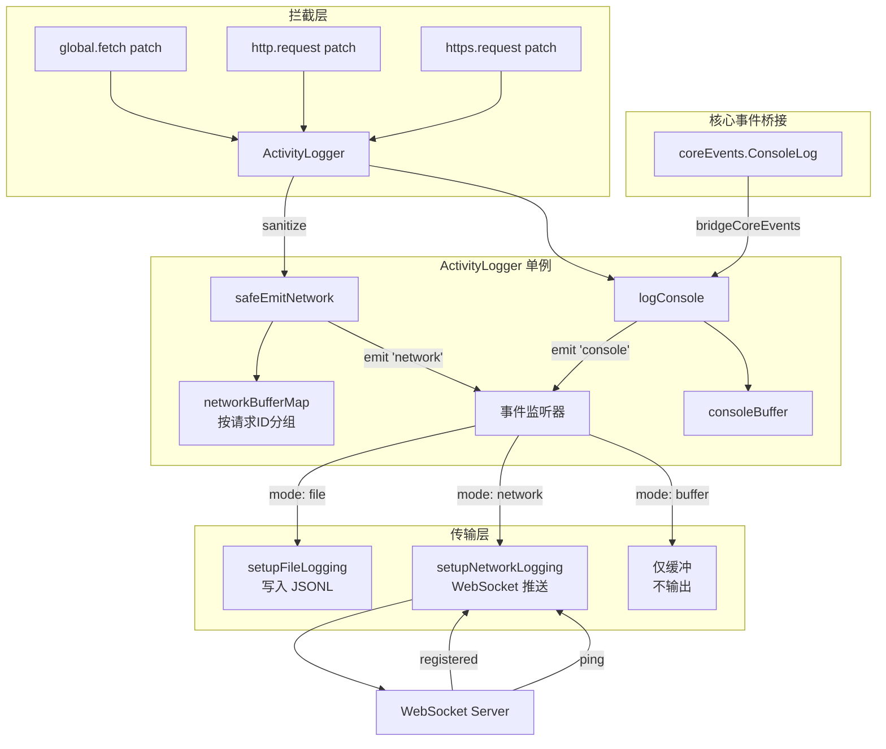

# activityLogger.ts

> 会话活动（网络请求和控制台日志）的捕获与记录系统，支持文件、WebSocket 和缓冲三种传输模式。

## 概述

`activityLogger.ts` 实现了一个全局活动日志记录器，用于拦截和记录 CLI 运行期间的所有网络请求（HTTP/HTTPS/fetch）和控制台输出。它采用**单例模式**管理 `ActivityLogger` 实例，通过 monkey-patch 全局 `fetch`、`http.request` 和 `https.request` 实现透明的网络请求拦截。捕获到的数据可以通过三种传输模式输出：WebSocket（实时推送到 DevTools）、JSONL 文件（持久化到磁盘）或仅在内存中缓冲。

该模块还包含敏感信息脱敏机制（自动隐藏 `authorization`、`cookie`、`x-goog-api-key` 等请求头），以及 WebSocket 断线重连和缓冲区溢出驱逐策略。

## 架构图（mermaid）

## 主要导出

| 导出名称 | 类型 | 描述 |
|---------|------|------|
| `NetworkLog` | 接口 | 完整网络请求日志的数据结构，包含请求/响应/分块信息 |
| `PartialNetworkLog` | 类型 | 网络日志的增量更新结构（必须包含 `id`） |
| `ActivityLogger` | 类 | 核心单例类，继承 `EventEmitter`，负责拦截、缓冲和分发活动日志 |
| `initActivityLogger` | 函数 | 初始化活动日志记录器，指定传输模式（`network` / `file` / `buffer`） |
| `addNetworkTransport` | 函数 | 向已有的 ActivityLogger 单例追加 WebSocket 传输通道 |

### ActivityLogger 关键方法

| 方法 | 描述 |
|------|------|
| `getInstance()` | 获取全局单例 |
| `enable()` | 启用全局 fetch / HTTP 拦截 |
| `enableNetworkLogging()` / `disableNetworkLogging()` | 控制网络日志推送开关 |
| `drainBufferedLogs()` | 原子性地返回并清空所有缓冲日志 |
| `getBufferedLogs()` | 读取缓冲日志（不清空） |
| `logConsole(payload)` | 记录控制台日志条目 |

## 核心逻辑

### 1. 网络请求拦截

- **fetch 拦截**：替换 `global.fetch`，为每个请求生成唯一 ID，注入 `x-activity-request-id` 头，流式读取响应 body 并逐块发射事件。跳过 `127.0.0.1` 和 `localhost` 的本地请求。
- **HTTP/HTTPS 拦截**：通过 `Object.defineProperty` 替换 `http.request` 和 `https.request`，monkey-patch `req.write` 和 `req.end` 捕获请求体，监听 `response` 事件的 `data`/`end` 捕获响应体。支持 gzip / deflate 解压缩。
- **去重机制**：如果请求头中已包含 `x-activity-request-id`（表示从 fetch 层已经拦截过），则在 HTTP 层跳过重复拦截。

### 2. 敏感信息脱敏

`sanitizeNetworkLog` 方法自动将 `authorization`、`cookie`、`x-goog-api-key` 请求头和 `set-cookie` 响应头替换为 `[REDACTED]`。

### 3. 缓冲区管理

- 网络日志按请求 ID 分组存储在 `networkBufferMap` 中，最多保留 10 个请求组（`bufferLimit`）。
- 控制台日志保留最近 10 条。
- 超限时采用 FIFO 驱逐策略。

### 4. WebSocket 传输

- 连接后发送 `register` 消息注册会话。
- 收到 `registered` 后启动 15 秒心跳定时器并刷新缓冲区。
- 断线后自动重连（最多 2 次），重连失败触发 `onReconnectFailed` 回调（用于 DevTools 晋升）。
- 传输缓冲区最大 100 条（`MAX_BUFFER_SIZE`）。

### 5. 文件传输

将日志以 JSONL 格式异步追加到文件，每行包含 `type`、`payload`、`sessionId`、`timestamp` 字段。

## 内部依赖

| 模块 | 用途 |
|------|------|
| `@google/gemini-cli-core` | `CoreEvent`、`coreEvents`（事件桥接）、`debugLogger`（调试日志）、`ConsoleLogPayload`/`Config` 类型 |

## 外部依赖

| 模块 | 用途 |
|------|------|
| `node:http` / `node:https` | HTTP/HTTPS 请求拦截 |
| `node:zlib` | 响应体 gzip / deflate 解压缩 |
| `node:fs` / `node:path` | JSONL 文件写入 |
| `node:events` | `EventEmitter` 基类 |
| `ws` | WebSocket 客户端连接 |
