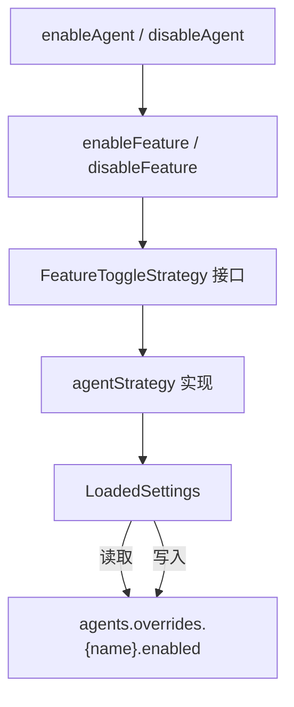

# agentSettings.ts

> 提供 Agent（智能代理）的启用/禁用设置管理功能，基于通用特性开关策略模式实现。

## 概述

`agentSettings.ts` 封装了对 Agent 配置的启用和禁用操作。它基于 `featureToggleUtils.ts` 中定义的通用特性开关策略模式（`FeatureToggleStrategy`），针对 Agent 的白名单启用机制定义了具体策略：通过 `agents.overrides.<agentName>.enabled` 配置路径控制 Agent 的启用状态。

Agent 采用**白名单模式**——默认未启用，需要在设置中显式设置 `enabled: true` 才会激活。

## 架构图（mermaid）

## 主要导出

| 导出名称 | 类型 | 描述 |
|---------|------|------|
| `AgentActionStatus` | 类型别名 | 操作状态：`'success'` / `'no-op'` / `'error'` |
| `AgentActionResult` | 接口 | Agent 操作的结果元数据，包含 `agentName`、`action`、`status` 等字段 |
| `enableAgent(settings, agentName)` | 函数 | 在所有可写作用域中启用指定 Agent |
| `disableAgent(settings, agentName, scope)` | 函数 | 在指定作用域中禁用指定 Agent |

## 核心逻辑

### agentStrategy（内部策略对象）

- `needsEnabling`：检查指定作用域中 `agents.overrides[agentName].enabled` 是否不为 `true`
- `enable`：设置 `agents.overrides.<agentName>.enabled` 为 `true`
- `isExplicitlyDisabled`：检查是否显式设置为 `false`
- `disable`：设置 `agents.overrides.<agentName>.enabled` 为 `false`

### enableAgent

遍历 User 和 Workspace 两个可写作用域，在需要启用的作用域中设置 `enabled: true`。如果已在所有作用域中启用，则返回 `no-op` 状态。

### disableAgent

在指定的单个作用域中设置 `enabled: false`。如果该作用域已经禁用，则返回 `no-op` 状态。

## 内部依赖

| 模块 | 用途 |
|------|------|
| `../config/settings.js` | `SettingScope`、`LoadedSettings` 类型定义 |
| `./featureToggleUtils.js` | `enableFeature`、`disableFeature` 通用开关函数，`FeatureToggleStrategy`、`FeatureActionResult` 类型 |

## 外部依赖

无。
