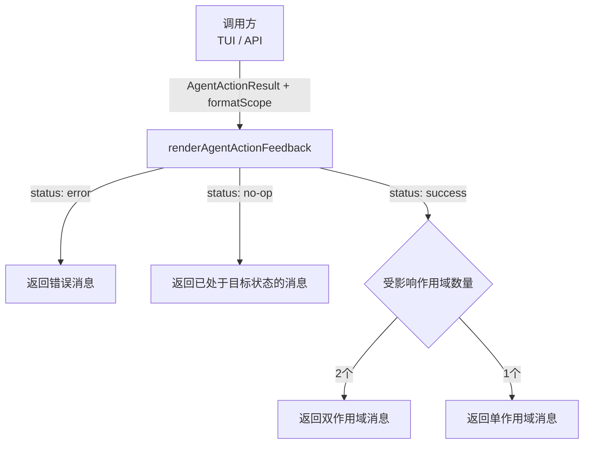

# agentUtils.ts

> 构建 Agent 操作结果的用户反馈消息，支持自定义作用域标签的渲染格式。

## 概述

`agentUtils.ts` 提供了一个纯函数 `renderAgentActionFeedback`，用于根据 Agent 启用/禁用操作的结果（`AgentActionResult`）生成面向用户的反馈消息。该函数将消息内容的构建与 UI 渲染逻辑分离——调用方通过传入 `formatScope` 回调函数来控制作用域标签的具体渲染方式（如加粗、灰色显示等），从而实现 TUI 和其他界面的复用。

## 架构图（mermaid）

## 主要导出

| 导出名称 | 类型 | 描述 |
|---------|------|------|
| `renderAgentActionFeedback(result, formatScope)` | 函数 | 根据操作结果和格式化回调构建反馈消息字符串 |

## 核心逻辑

1. **错误处理**：若 `status === 'error'`，返回错误消息或默认提示。
2. **无操作**：若 `status === 'no-op'`，返回"Agent 已处于目标状态"的消息。
3. **成功**：合并 `modifiedScopes` 和 `alreadyInStateScopes` 生成完整的受影响作用域列表：
   - 2 个作用域时，用 "and" 连接；启用时描述为 "by setting it to enabled in"，禁用时描述为 "is now disabled in both"。
   - 1 个作用域时，直接拼接。
4. 作用域标签映射：`Workspace` 显示为 `"project"`，其他作用域转为小写。

## 内部依赖

| 模块 | 用途 |
|------|------|
| `../config/settings.js` | `SettingScope` 枚举用于作用域标签映射 |
| `./agentSettings.js` | `AgentActionResult` 类型定义 |

## 外部依赖

无。
