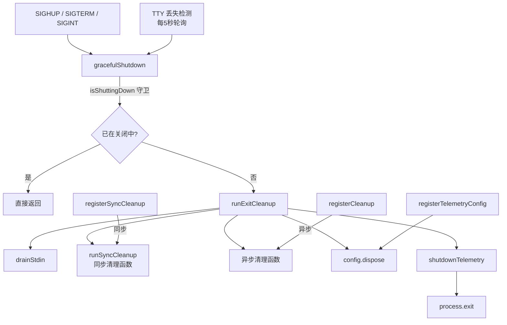

# cleanup.ts

> 管理进程退出时的清理逻辑，包括信号处理、TTY 状态检测和遥测数据刷新。

## 概述

`cleanup.ts` 是 CLI 应用的进程生命周期管理模块。它维护两类清理函数注册表（同步和异步），在进程退出时按序执行所有注册的清理操作。模块同时处理 Unix 信号（SIGHUP、SIGTERM、SIGINT）和 TTY 连接丢失的优雅关闭，确保遥测数据正确刷新、config 资源正确释放。通过 `isShuttingDown` 标志保证关闭流程只执行一次，防止多个信号竞争导致重复清理。

## 架构图（mermaid）

## 主要导出

| 导出名称 | 类型 | 描述 |
|---------|------|------|
| `registerCleanup(fn)` | 函数 | 注册一个异步或同步清理函数 |
| `registerSyncCleanup(fn)` | 函数 | 注册一个同步清理函数 |
| `resetCleanupForTesting()` | 函数 | 重置内部状态（仅测试用） |
| `runSyncCleanup()` | 函数 | 立即执行所有同步清理函数 |
| `registerTelemetryConfig(config)` | 函数 | 注册 Config 实例用于遥测关闭 |
| `runExitCleanup()` | 函数 | 执行完整的退出清理流程 |
| `setupSignalHandlers()` | 函数 | 注册 SIGHUP/SIGTERM/SIGINT 信号处理器 |
| `setupTtyCheck()` | 函数 | 启动 TTY 丢失检测定时器，返回取消函数 |
| `cleanupCheckpoints()` | 函数 | 删除项目临时目录下的 checkpoints 文件夹 |

## 核心逻辑

### 退出清理流程（runExitCleanup）

1. **drainStdin**：恢复 stdin 并附加空操作监听器，等待 50ms 让 OS 缓冲区刷新，防止退出时打印垃圾字符。
2. **runSyncCleanup**：执行所有同步清理函数，忽略错误。
3. **异步清理**：依次 await 所有注册的异步清理函数，忽略错误。
4. **config.dispose**：释放 Config 资源。
5. **shutdownTelemetry**：最后刷新遥测 SDK，确保 SessionEnd 等事件被正确上报。

### TTY 检测（setupTtyCheck）

每 5 秒检查 `process.stdin.isTTY` 和 `process.stdout.isTTY`，如果均不是 TTY，则触发优雅关闭。沙箱环境（`SANDBOX` 环境变量）下跳过检测。定时器通过 `unref()` 设置为不阻止进程退出。

### 竞争保护

`gracefulShutdown` 使用 `isShuttingDown` 布尔标志实现一次性执行，防止多个信号（如 SIGHUP 和 TTY 丢失）同时触发导致的竞态问题。

## 内部依赖

| 模块 | 用途 |
|------|------|
| `@google/gemini-cli-core` | `Storage`（检查点清理）、`shutdownTelemetry`、`isTelemetrySdkInitialized`、`ExitCodes`、`Config` 类型 |

## 外部依赖

| 模块 | 用途 |
|------|------|
| `node:fs` (promises) | 文件系统操作（删除检查点目录） |
| `node:path` | 路径拼接 |
