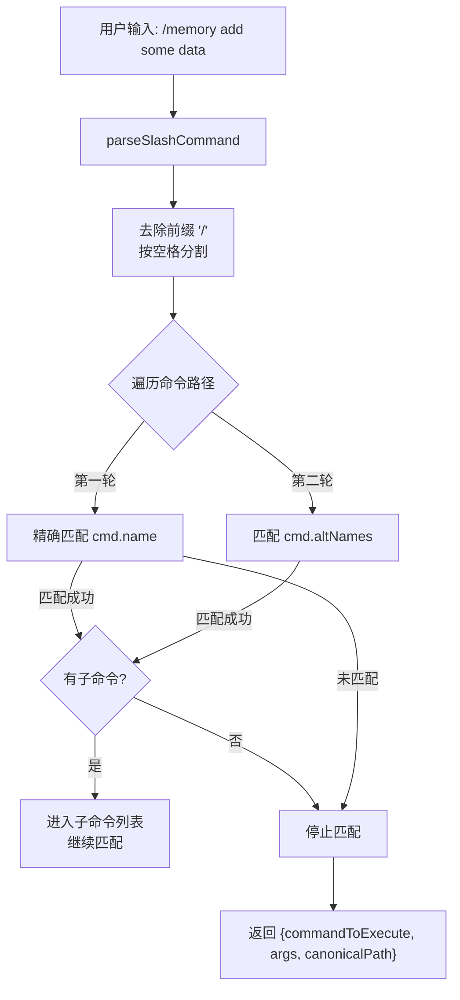

# commands.ts

> 解析用户输入的斜杠命令字符串，匹配到对应的命令对象并提取参数。

## 概述

`commands.ts` 提供了斜杠命令（Slash Command）的解析功能。它接收用户的原始输入字符串（如 `/memory add some data`），在已注册的命令树中进行匹配，支持主命令名和别名的两轮查找，以及嵌套子命令的递归解析。解析结果包含匹配到的命令对象、剩余参数和规范化的命令路径。

## 架构图（mermaid）

## 主要导出

| 导出名称 | 类型 | 描述 |
|---------|------|------|
| `ParsedSlashCommand` | 类型 | 解析结果结构：`commandToExecute`（命令对象或 undefined）、`args`（参数字符串）、`canonicalPath`（规范路径数组） |
| `parseSlashCommand(query, commands)` | 函数 | 解析斜杠命令字符串，返回匹配的命令、参数和路径 |

## 核心逻辑

1. **预处理**：去除输入的前导 `/` 和空白，按空格分割为命令路径部分。
2. **逐级匹配**：对路径的每个部分，先精确匹配 `cmd.name`，若不匹配则检查 `cmd.altNames` 别名列表。
3. **子命令递归**：如果匹配到的命令包含 `subCommands`，则进入子命令列表继续匹配下一个路径部分。
4. **参数提取**：未被匹配消耗的路径部分重新拼接为参数字符串。
5. **规范路径**：记录每级匹配成功的命令的主名称（`name`），形成 `canonicalPath`。

## 内部依赖

| 模块 | 用途 |
|------|------|
| `../ui/commands/types.js` | `SlashCommand` 类型定义 |

## 外部依赖

无。
