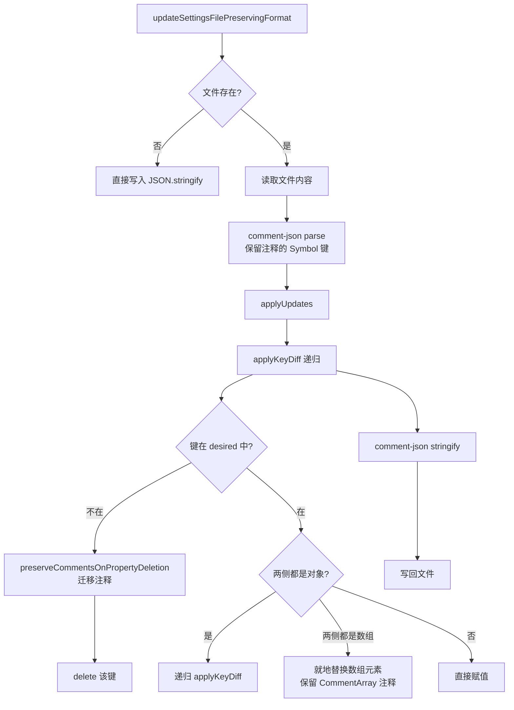

# commentJson.ts

> 在更新 JSON 配置文件时保留注释和格式，支持增删改键的同步语义。

## 概述

`commentJson.ts` 解决了标准 `JSON.parse/stringify` 会丢失注释的问题。它使用 `comment-json` 库解析带注释的 JSON 文件，在内存中对解析后的对象进行就地修改（保留 Symbol 键上挂载的注释元数据），然后重新序列化写回文件。

核心操作语义是 **"按省略同步"（sync-by-omission）**：以 `updates` 对象为期望状态，基于 `base` 对象进行对齐——添加新键、更新已有键、删除 `updates` 中不存在的键。删除键时会自动将其上的注释迁移到相邻键，避免注释丢失。

## 架构图（mermaid）

## 主要导出

| 导出名称 | 类型 | 描述 |
|---------|------|------|
| `updateSettingsFilePreservingFormat(filePath, updates)` | 函数 | 更新 JSON 文件，保留注释和格式 |

## 核心逻辑

### updateSettingsFilePreservingFormat

入口函数。若文件不存在则直接用 `JSON.stringify` 创建新文件；否则用 `comment-json` 解析后进行就地更新再写回。

### applyKeyDiff（递归差异同步）

- **删除**：遍历 `base` 的所有键，若不在 `desired` 中，调用 `preserveCommentsOnPropertyDeletion` 迁移注释后删除。
- **添加/更新**：遍历 `desired` 的所有键：
  - 双方都是普通对象：递归调用 `applyKeyDiff`
  - 双方都是数组：清空基础数组后逐元素 push（保留 `CommentArray` 上的注释）
  - 否则直接赋值

### preserveCommentsOnPropertyDeletion（注释迁移）

`comment-json` 将注释存储在 `Symbol.for('before:propName')` 和 `Symbol.for('after:propName')` 等 Symbol 键上。删除属性时：
1. 优先将注释迁移到下一个兄弟键的 `before` 注释
2. 其次迁移到上一个兄弟键的 `after` 注释
3. 最后迁移到容器对象的 `before`/`after` 注释

## 内部依赖

| 模块 | 用途 |
|------|------|
| `@google/gemini-cli-core` | `coreEvents`（解析错误时发送反馈） |

## 外部依赖

| 模块 | 用途 |
|------|------|
| `node:fs` | 文件读写 |
| `comment-json` | 带注释的 JSON 解析（`parse`）和序列化（`stringify`） |
