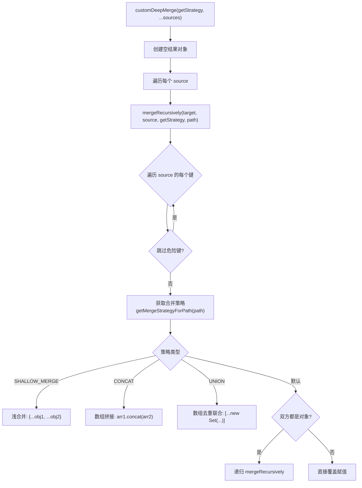

# deepMerge.ts

> 支持可配置合并策略的深度对象合并工具，用于多层级设置的叠加合并。

## 概述

`deepMerge.ts` 实现了一个可定制的深度合并函数 `customDeepMerge`，用于将多个配置源对象按优先级叠加合并。与简单的递归合并不同，它允许通过回调函数为不同的配置路径指定不同的合并策略（如浅合并、数组拼接、数组去重联合等），从而精确控制设置文件中各字段的合并行为。

该模块内置了原型污染防护机制，会跳过 `__proto__`、`constructor`、`prototype` 等危险键。

## 架构图（mermaid）

## 主要导出

| 导出名称 | 类型 | 描述 |
|---------|------|------|
| `Mergeable` | 类型 | 可合并值的联合类型（string / number / boolean / null / undefined / object / Mergeable[]） |
| `MergeableObject` | 类型 | `Record<string, Mergeable>` 的别名 |
| `customDeepMerge(getMergeStrategyForPath, ...sources)` | 函数 | 按策略深度合并多个对象 |

## 核心逻辑

### 合并策略

通过 `getMergeStrategyForPath(path: string[])` 回调函数，调用方可以为任意配置路径指定合并策略：

| 策略 | 行为 |
|------|------|
| `MergeStrategy.SHALLOW_MERGE` | 对两个对象值进行浅合并（展开运算符） |
| `MergeStrategy.CONCAT` | 将源数组拼接到目标数组末尾 |
| `MergeStrategy.UNION` | 将两个数组合并后去重（Set 语义） |
| `undefined`（默认） | 对象递归合并，其他类型直接覆盖 |

### 原型污染防护

`mergeRecursively` 显式跳过 `__proto__`、`constructor`、`prototype` 键，防止通过 `JSON.parse` 产生的恶意对象进行原型链污染攻击。

### 递归合并

- 双方都是普通对象：递归进入
- 仅源值为对象：在目标上创建空对象后递归
- 源值为 `undefined`：跳过
- 其他情况：直接赋值覆盖

## 内部依赖

| 模块 | 用途 |
|------|------|
| `../config/settingsSchema.js` | `MergeStrategy` 枚举定义 |

## 外部依赖

无。
